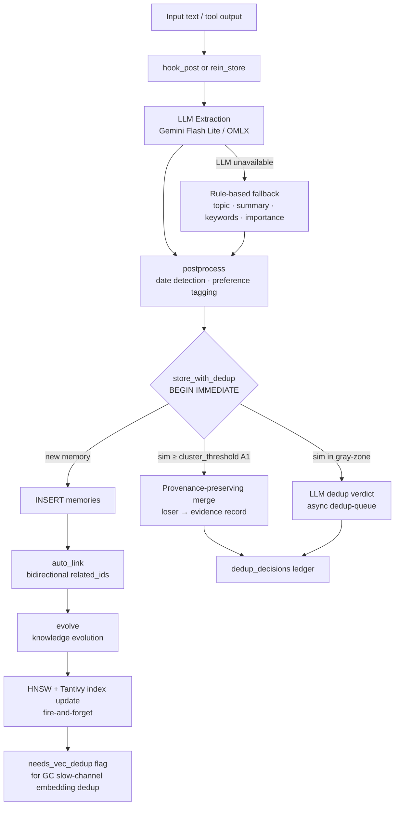
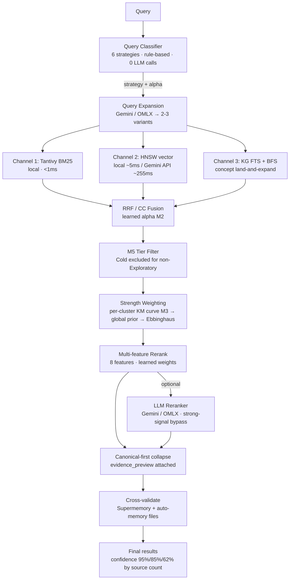
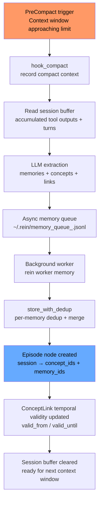
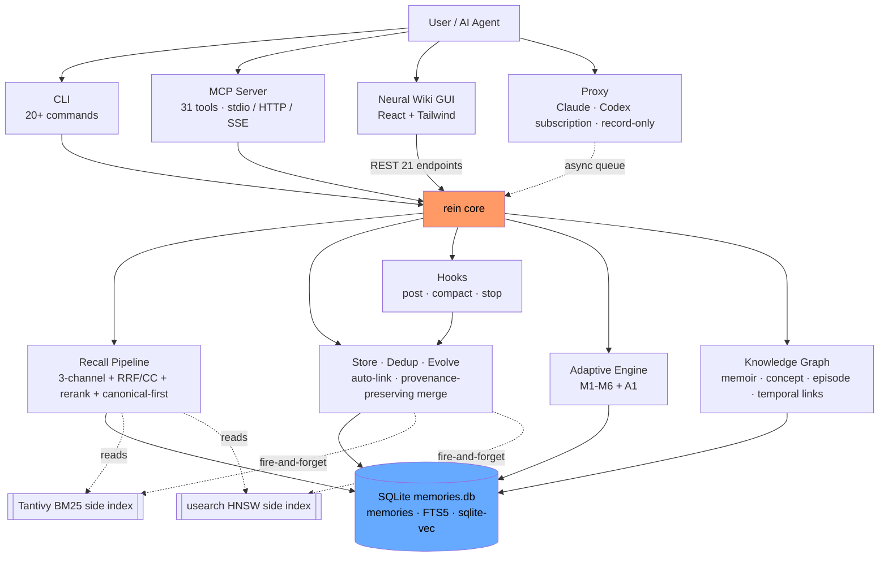
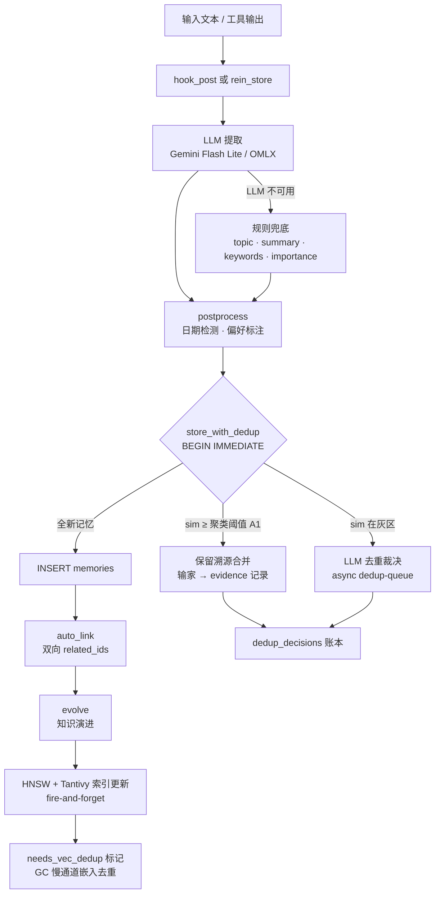
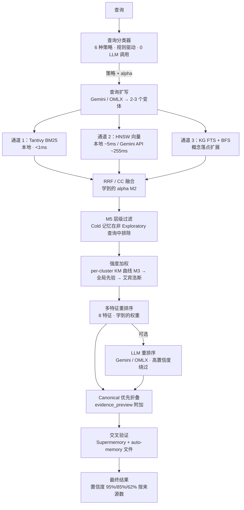
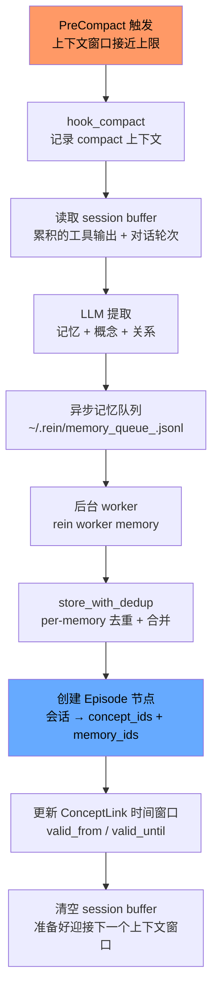
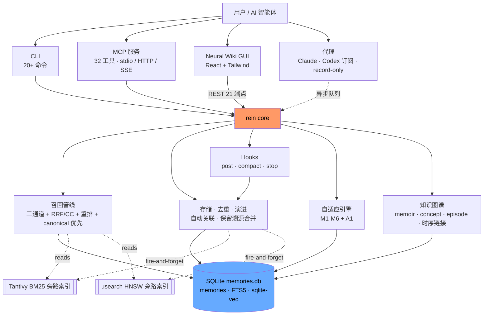

# rein

> Multi-source cross-validated memory for AI agents

<p align="center">
  <a href="#english">English</a> | <a href="#中文">中文</a>
</p>

---

## English

rein is a self-adaptive memory system for AI coding agents. It stores, recalls, and manages memories across sessions with embedding-based semantic dedup, data-driven decay (Kaplan-Meier survival curves), and a fully closed self-learning loop that replaces fixed parameters with learned values.

### Features

| Feature | Description |
|---------|-------------|
| **32 MCP tools** | 8 core memory + 9 maintenance (incl. v0.23 `rein_resummerize`) + 10 knowledge graph + 2 temporal + 2 adaptive + 1 session ingest |
| **Unified operation registry** | One `#[op]` declaration drives CLI / MCP / REST surfaces (v0.21, A1). Inventory-based dispatch; zero hand-maintained lists. |
| **Neural Wiki GUI** | React + Tailwind web dashboard with Brain View, Adaptive Engine, Knowledge Graph, Timeline, and more |
| **Self-adaptive engine** | M1-M6: all learning loops closed — data drives fusion weights, decay curves, dedup thresholds, and tier boundaries |
| **Counterfactual alpha learning** | Replays past recalls to find optimal CC fusion weights — global, per-query-type, and per-cluster (M2) |
| **Per-cluster survival decay** | Kaplan-Meier curves replace fixed Ebbinghaus per-cluster; global prior bridges cold-start (M3) |
| **HDBSCAN clustering** | Pure Rust semantic clustering with sampling for large datasets (M4) |
| **Hot/Warm/Cold tiering** | Streaming quantile estimator + cold_archive migration (M5) |
| **Adaptive dedup thresholds** | Per-cluster P90 similarity thresholds (SemDeDup-inspired, M6/A1) |
| **Provenance-preserving dedup** | Merges preserve temporal anchors and unique details instead of hard-deleting |
| **Embedding semantic dedup** | Catches paraphrases Jaccard misses, runs in GC slow channel (zero hot-path cost) |
| **Temporal knowledge graph** | Memoir / Concept / ConceptLink with 9 relation types, revision history, episode nodes, temporal validity windows, BFS traversal (skips expired links) |
| **Autonomous retrieval routing** | Rule-based query classifier routes to 6 strategies: Episodic / Temporal / Preference / ExactKeyword / Semantic / Exploratory (zero LLM calls) |
| **Query expansion** | LLM rewrites query into 2-3 variants (Gemini Flash Lite / OMLX); multi-query results merged before fusion |
| **LLM reranker** | Optional Gemini / OMLX rescoring of top-N candidates; strong-signal bypass skips LLM when confidence is already high |
| **Maximal Marginal Relevance** | MMR post-rerank diversity pass — balances relevance and variety in final result set |
| **OMLX local embedding** | Optional local embedding backend via EmbedderKind enum dispatch (Google / OMLX) |
| **Dual-layer decay** | LTM / STM layers with KM survival curves (data-driven) or Ebbinghaus (cold-start) |
| **Dual-path search** | FTS (Tantivy BM25 → FTS5 fallback) + Vector (HNSW cache → API embed) → RRF/CC fusion |
| **Multi-source cross-validation** | 3 sources (local, hook-extracted, Supermemory) with confidence scoring |
| **RRF / CC fusion** | Reciprocal Rank Fusion or Convex Combination (Bruch 2023), with learned alpha weights |
| **Multi-factor admission** | A-MAC 2026 inspired: llm_conf + novelty + type_prior + recency scoring |
| **Semantic chunking** | Heading / paragraph / sentence splitting with metadata-prefixed embeddings |
| **FTS5 unicode61 tokenizer** | Full-text search with CJK support, sub-millisecond latency |
| **Hybrid CJK dedup tokenization** | jieba-rs word segmentation plus character bigrams for Chinese/Japanese/Korean lexical dedup |
| **Cluster-aware admission** | admission threshold and novelty scoring incorporate cluster strength, cluster novelty, and cold-start blending |
| **Evidence second-stage rerank** | low-confidence / single-source recall results can be boosted by matching evidence content |
| **Survival-driven STM promotion** | STM→LTM promotion uses cluster survival curves when available |
| **ANN fallback for unclustered dedup** | large `cluster_id=None` buckets generate vector-neighbor candidates before pairwise dedup |
| **Adaptive cluster decisions UI** | Adaptive page surfaces per-cluster dedup/admission/promotion decisions |
| **Supermemory v4 API** | Hybrid search via `api.supermemory.ai/v4/search` for cross-validation |
| **Zero local models** | No GPU required by default; optional OMLX local backend |
| **~2-5 MB footprint** | Single SQLite file with FTS5 + sqlite-vec |
| **gemini-embedding-001** | MTEB #1 model (68.32), 3072 dimensions |
| **20+ CLI commands** | Everything the MCP tools do, plus init, config, migrate, hooks, recent, gc, organize, upgrade |
| **Auto-configure** | `rein init` detects and configures 8 MCP clients automatically |
| **Remote access** | HTTP / SSE transport with bearer token authentication |

### Installation

#### From source

```bash
git clone https://github.com/lyr1cs/rein.git
cd rein

# Standard build (CLI + MCP server only)
cargo install --path crates/rein

# Full build with Neural Wiki GUI (recommended)
cargo install --path crates/rein --features gui
```

Or use the install script:

```bash
./scripts/install.sh
```

The install script builds the embedded GUI by default when `npm` is available. Set `REIN_INSTALL_GUI=0` for a CLI-only install.

#### Prerequisites

- Rust toolchain (1.75+)
- Node.js + npm (for GUI builds or the default install script path)
- A Gemini API key (free tier: 1500 req/day)

#### GUI Service Management

```bash
# Start GUI server in background (listens on :8680)
rein gui on

# Stop GUI server
rein gui off

# Or run in foreground with MCP + GUI
rein serve --gui

# Open in browser
open http://localhost:8680
```

The GUI requires building with `--features gui`. Without it, the `gui` subcommand is available but serves no embedded assets.

### Quick Start

```bash
# 1. Set your API key
export GEMINI_API_KEY="your-key-here"

# 2. Auto-configure all detected MCP clients
rein init

# 3. Start the MCP server (usually done by your client)
rein serve
```

### CLI Reference

| Command | Description | Example |
|---------|-------------|---------|
| `serve` | Start MCP server (stdio, SSE, proxy, or GUI) | `rein serve [--compact] [--sse] [--proxy] [--gui]` |
| `store` | Store a memory | `rein store -t debug -c "OOM fix" -I high -k oom,memory` |
| `recall` | Search memories | `rein recall "connection pool" -t debug -l 5` |
| `forget` | Delete a memory by ID | `rein forget 01J...` |
| `update` | Update memory content | `rein update 01J... -c "new content" -I critical` |
| `topics` | List all topics | `rein topics` |
| `stats` | Show store statistics | `rein stats` |
| `health` | Check topic health | `rein health [topic]` |
| `consolidate` | Merge one or many topics into consolidated memories | `rein consolidate --pattern 'rmcp*' --merge-variants --dry-run` |
| `dedup` | Scan / remove duplicates, optionally across topic variants | `rein dedup [--dry-run] [--merge-variants]` |
| `cleanup` | One-click consolidation + dedup + adaptive refresh | `rein cleanup [--pattern 'rmcp*'] [--dry-run] [--async]` |
| `migrate` | Import from QMD / reindex | `rein migrate [--from-qmd path] [--reindex]` |
| `init` | Auto-configure MCP clients | `rein init [--dry-run]` |
| `config` | Show current configuration | `rein config` |
| `recent` | Show most recent memories | `rein recent [-l 20]` |
| `canonicals` | Show canonical memories | `rein canonicals [-l 20]` |
| `evidence` | Show evidence snapshots for a canonical memory | `rein evidence <canonical_id> [-l 20]` |
| `dedup-log` | Show recent dedup decisions | `rein dedup-log [--canonical ID] [-l 20]` |
| `gc` | Garbage collect weak STM memories | `rein gc [--dry-run]` |
| `organize` | Auto-link related memories | `rein organize` |
| `dedup-concepts` | Merge duplicate concepts (case/separator variants) | `rein dedup-concepts` |
| `upgrade` | Upgrade old memories to knowledge graph | `rein upgrade [--topic X] [--dry-run]` |
| `hook post` | Extract facts from tool output | `rein hook post` |
| `hook compact` | Save context before compaction | `rein hook compact` |
| `hook prompt` | Compatibility no-op for UserPromptSubmit | `rein hook prompt` |
| `hook stop` | Full knowledge extraction on session end | `rein hook stop` |
| `worker memory` | Drain the async memory queue | `rein worker memory` |
| `worker dedup-queue` | Drain queued store-time dedup jobs | `rein worker dedup-queue` |
| `worker cleanup-queue` | Drain queued cleanup jobs | `rein worker cleanup-queue` |
| `dashboard` | Show service status, metrics, memory stats | `rein dashboard` |
| `gui on/off` | Start/stop GUI server in background | `rein gui on` |
| `proxy on/off` | Start/stop proxy in background | `rein proxy on` |

### How Cleanup Works (Provenance-Preserving)

rein's cleanup pipeline is **provenance-preserving**: it never hard-deletes information. The process has three stages:

1. **Consolidation** — Groups topic variants (e.g., `Docker Deployment` / `docker-deployment`) and merges all memories within each group into a single high-quality canonical memory. Source memories become evidence records in the `memory_evidence` table, preserving their original content, timestamps, and keywords.

2. **Dedup** — Scans for content-level duplicates within each topic group using lexical similarity (Jaccard + containment) and optionally embedding cosine similarity. Matches above threshold are merged into the winner; the loser's unique lines are appended with provenance markers (`[merged from <id> on <date>]`) and the loser is recorded as evidence.

3. **Adaptive refresh** — After consolidation and dedup, the adaptive engine (M1-M6) runs: HDBSCAN re-clusters, survival curves rebuild, tier boundaries update, and alpha/threshold learning processes new events.

Every merge decision is logged in the `dedup_decisions` append-only ledger with winner/loser IDs, scores, relation type, confidence, and operator. This is rein's equivalent of Git's reflog — you can always trace how a canonical memory was formed.

```bash
# Preview what cleanup would do (safe)
rein cleanup --all --dry-run

# Run cleanup on specific topics
rein cleanup --topic "docker-deployment"

# Full store cleanup
rein cleanup --all

# Queue cleanup for background processing
rein cleanup --all --async
```

`consolidate` keeps the old `rein consolidate <topic> -s "summary"` flow, but also supports:
- `--topics a,b,c` to batch a named topic set
- `--pattern 'rmcp*'` to batch by glob
- `--all` to process every topic
- `--merge-variants` to group case/space/hyphen variants such as `Docker Deployment` / `docker-deployment`
- omitting `--summary` to let rein auto-generate a consolidated memory, using the configured LLM when available and a local fallback otherwise

Batch consolidation fans out LLM synthesis asynchronously and in parallel, then commits SQLite writes sequentially. Cleanup actions also emit adaptive feedback and refresh M1-M6 state after the batch completes.

Cleanup is now scoped-first:
- `rein cleanup --topic X`, `--topics ...`, or `--pattern ...` only deduplicates the selected groups
- `rein cleanup` with no scope still runs across the whole store
- `rein cleanup --dry-run` previews the scope
- `rein cleanup --async` queues a durable cleanup job and wakes a background cleanup worker

Store-time gray-zone dedup now also uses a dedicated async queue:
- hot-path store creates the new memory without blocking on remote LLM verdicts
- a `dedup-queue` worker later resolves gray-zone pairs with structured LLM verdicts
- you can drain it manually with `rein worker dedup-queue`

Recall is now evidence-aware:
- canonical memories are ranked with `support_count` and `source_diversity`
- recall output includes lightweight `evidence_preview`
- `rein evidence <canonical_id>` or `/api/memories/:id` expands the full evidence list
- lower-confidence / lower-corroboration results can use evidence second-stage rerank

Adaptive learning now sees richer canonical signals:
- reranker learning uses support / diversity features
- alpha optimization uses KG / episode / support / diversity-aware candidate scoring
- Adaptive GUI surfaces cluster-level dedup / admission / promotion decisions

CJK dedup now uses a hybrid lexical strategy:
- `jieba-rs` adds Chinese word segmentation
- character bigrams remain enabled as a fallback for CJK and mixed technical text
- both token streams are combined before Jaccard / containment scoring

More detailed docs:
- `docs/guides/canonical-read-model.md`
- `docs/guides/evidence-aware-recall.md`
- `docs/reference/adaptive-learning-signals.md`

Audit / handoff commit chain:
- `8b9e747`
- `b358100`
- `b861a4f`
- `1b0765a`
- `45de919`
- `d92170a`
- `d7200b3`

Operator inspection commands:
- `rein canonicals` shows canonical memories and their support/merge counters
- `rein evidence <canonical_id>` shows absorbed evidence snapshots
- `rein dedup-log` shows the recent dedup ledger

### MCP Tools

When running as an MCP server (`rein serve`), 31 tools are exposed.

#### Core Tools (13)

| Tool | Parameters | Description |
|------|-----------|-------------|
| `rein_recall` | `query`, `topic?`, `keyword?`, `limit?`, `from?`, `to?` | Semantic search with optional time range |
| `rein_store` | `topic`, `content`, `importance?`, `keywords?` | Store a new memory (auto-dedup) |
| `rein_update` | `id`, `content`, `importance?` | Update an existing memory |
| `rein_forget` | `id` | Delete a memory by ID |
| `rein_list_topics` | *(none)* | List all memory topics |
| `rein_stats` | *(none)* | Total count, LTM/STM breakdown, avg strength |
| `rein_health` | `topic?` | Stale count, avg strength, consolidation hints |
| `rein_consolidate` | `topic?`, `topics?`, `pattern?`, `all?`, `merge_variants?`, `summary?`, `dry_run?` | Consolidate one or many topics, optionally grouping topic variants first |
| `rein_dedup` | `dry_run?`, `merge_variants?` | Scan for and remove duplicate memories, optionally across topic variants |
| `rein_cleanup` | `topic?`, `topics?`, `pattern?`, `all?`, `exact_topics?`, `dry_run?` | One-click cleanup: consolidate fragmented topics, deduplicate, and refresh adaptive state |
| `rein_recent` | `limit?` | List most recently created memories |
| `rein_gc` | `dry_run?` | Garbage collect weak STM memories |
| `rein_organize` | `max_links?` | Auto-link related memories |

#### Knowledge Graph Tools (10)

| Tool | Parameters | Description |
|------|-----------|-------------|
| `rein_memoir_create` | `name`, `description?` | Create a knowledge container |
| `rein_memoir_list` | *(none)* | List all memoirs |
| `rein_memoir_show` | `name` | Show memoir details + concepts |
| `rein_memoir_add_concept` | `memoir`, `name`, `definition`, `labels?` | Add a knowledge node |
| `rein_memoir_refine` | `memoir`, `name`, `definition` | Update concept, boost confidence |
| `rein_memoir_search` | `memoir`, `query`, `limit?` | FTS search within a memoir |
| `rein_memoir_search_all` | `query`, `limit?` | Search across all memoirs |
| `rein_memoir_link` | `memoir`, `from`, `to`, `relation` | Link two concepts |
| `rein_memoir_inspect` | `memoir`, `name`, `depth?` | BFS neighborhood traversal |
| `rein_memoir_export` | `memoir`, `format?` | Export graph (json / ascii / dot) |

#### Temporal Tools (2)

| Tool | Parameters | Description |
|------|-----------|-------------|
| `rein_timeline` | `from?`, `to?`, `limit?` | Chronological timeline of episodes, concept changes, and memory events |
| `rein_concept_history` | `memoir`, `name`, `limit?` | Revision history of a concept: when/how it changed over time |

#### Adaptive & Session Tools (3)

| Tool | Parameters | Description |
|------|-----------|-------------|
| `rein_adaptive_status` | *(none)* | Inspect learned alpha weights, cluster profiles, dedup thresholds, survival curve stats |
| `rein_feedback` | `memory_ids`, `request_id?`, `query?`, `helpful?` | Report which recalled memories were used — drives M1 event sourcing and future recall quality |
| `rein_ingest_session` | `content?`, `turns?`, `title?`, `session_id?` | Ingest a full session transcript through the full extraction pipeline (memories + concepts + episode) |

#### Knowledge Graph Relation Types

`part_of`, `depends_on`, `related_to`, `contradicts`, `refines`, `alternative_to`, `caused_by`, `instance_of`, `superseded_by`

### LLM Extraction (v0.3)

rein uses LLM (Gemini 3.1 Flash Lite or local models via OMLX) for structured memory extraction. The hook system automatically builds a knowledge graph from coding sessions.

**Architecture:**
- `hook_post` — local pattern extraction (crash safety net) + buffer to session file
- `hook_compact` — record compact context for async extraction
- `hook_stop` — queue full session distillation: memories + concepts + links + episode summary
- `hook_prompt` — compatibility no-op (automatic prompt injection removed)

**Upgrade old memories:**
```bash
rein upgrade --dry-run    # preview
rein upgrade              # convert all old memories to knowledge graph
rein upgrade --topic debug  # convert specific topic only
```

**Configuration:**
```toml
[extract]
provider = "google"    # or "omlx" or "none"

[extract.google]
model = "gemini-3.1-flash-lite-preview"
max_input_chars = 0    # 0 = no truncation (1M token model)

[extract.omlx]
endpoint = "http://localhost:11434/v1"  # Ollama, LM Studio, vLLM, etc.
model = "default"
max_input_chars = 16000
```

### Self-Learning Quality System (v0.3.0)

rein automatically learns which memories are useful and which are noise, without human parameter tuning.

**How it works:**
1. LLM assigns `quality_confidence` (0-1) at extraction time — zero extra API cost
2. System tracks recall-then-access patterns to classify memories as "good" (used) or "bad" (recalled but unused)
3. Feature weights auto-adjust from data: utility, novelty, connectivity, recency
4. Adaptive admission threshold rises when recent quality is low, relaxes when high
5. GC prunes low-quality concepts whose source memories are recalled 5+ times but never accessed

**No manual tuning needed** — cold-starts with LLM judgment, data gradually takes over.

Based on: ICLR 2026 Admission Control, PropMem (Prosus), FActScore, MACLA Bayesian posteriors.

### Canonical-First Recall

rein now treats canonical memories as the default read model:

- store-time dedup tries to merge gray-zone writes into an existing canonical when evidence already exists
- admission/novelty scoring uses the current canonical view, not raw topic fragments
- working-set and always-on surfaces are refreshed from persisted canonical memories
- recall returns canonical memories by default, with `evidence_preview` for absorbed observations
- detail endpoints and GUI panels expand the full supporting evidence on demand

For API compatibility, `GET /api/memories/:id` returns the legacy top-level memory fields and also includes:

- `memory`: the canonical memory payload
- `evidence`: supporting evidence snapshots

### Temporal Knowledge Graph (v0.4.0)

rein now tracks **when** knowledge changes, not just what the current state is. Inspired by Zep/Graphiti 2025.

**Capabilities:**
- **Concept revision history** — every `refine_concept` auto-snapshots the old state before overwriting
- **Episode nodes** — each session creates an Episode linking to concepts and memories touched
- **Temporal link validity** — ConceptLink has `valid_from`/`valid_until` windows; expired links are skipped in BFS
- **Contradiction detection** — when a new definition differs significantly (sim < 0.3), old outgoing links are expired
- **Temporal recall** — `rein_recall` supports `from`/`to` date params for time-range filtering
- **Timeline view** — `rein_timeline` shows chronological events (episodes, concept changes, memory creation)
- **Concept history** — `rein_concept_history` shows how a concept's definition evolved over time

**Example queries enabled:**
- "What changed last week?" → `rein_timeline --from 2026-03-19 --to 2026-03-26`
- "When did concept X change?" → `rein_concept_history --memoir rust --name ownership`
- "What did I know about Y before March?" → `rein_recall "Y" --to 2026-03-01`

### Autonomous Retrieval Routing (v0.4.0)

rein automatically classifies queries and routes them to the optimal search strategy — no configuration needed.

| Query Type | Example | Strategy |
|------------|---------|----------|
| **Temporal** | "when did the API change?" | BM25 bias (alpha=0.7), auto-inject time bounds |
| **ExactKeyword** | "SqliteStore", "fn recall" | Heavy BM25 (alpha=0.85) |
| **Semantic** | "memory management strategies" | Vector dominant (alpha=0.3) |
| **Exploratory** | "what do I know about rein?" | Balanced (alpha=0.5), 2x result limit |

Classification is rule-based (zero LLM calls, sub-microsecond). MCP responses include `[route: type]` prefix for transparency. Based on TA-Mem 2026 and MemR3 2025.

### Adaptive Engine (v0.6.0+)

rein's core philosophy: **zero subjective parameters** — all parameters are data-driven and self-adaptive. The adaptive engine runs during GC in a slow channel (zero recall latency impact).

**Pipeline: M4 → A1 → M3 → M5 → M2 → M6**

| Module | What it learns | How |
|--------|---------------|-----|
| **M1** Event Sourcing | *(foundation)* | Append-only feedback log + per-consumer offsets |
| **M2** Alpha Optimizer | CC fusion weights — global, per-query-type, **and per-cluster** | Counterfactual replay; hierarchical Bayesian shrinkage; `apply_max_step` damping |
| **M3** Survival Analysis | Per-cluster decay curves + **global cold-start prior** | Kaplan-Meier estimator; global prior (capped at blend-zone) for new clusters |
| **M4** HDBSCAN Clustering | Semantic neighborhoods | Pure Rust HDBSCAN (dendrogram → condensed tree → EOMBST); centroid reassignment on recluster |
| **M5** Tiering | Hot/Warm/Cold boundaries | Streaming quantile estimator (P25/P75) + cold_archive migration |
| **M6** Threshold Explorer | Dedup thresholds | Randomized A/B exploration + causal inference + co-recall signal |
| **A1** Per-cluster dedup thresholds | Similarity cutoffs per cluster | P90 of intra-cluster pairwise similarity; full pipeline (store, batch, vec dedup) |

**Also:**
- **Embedding-based semantic dedup** in GC slow channel (catches paraphrases Jaccard misses)
- **Provenance-preserving merge** — temporal anchors and unique details never lost
- **Snapshot CAS** — adaptive state saved with read-merge-write on version conflict

### Architecture Diagrams

#### Memory Storage Flow



#### Recall Pipeline



#### Compression (PreCompact Hook)



---

### Configuration

rein loads configuration with the following priority (highest wins):

1. Environment variables
2. TOML config file (`$REIN_CONFIG` or `~/.config/rein/config.toml`)
3. Compiled-in defaults

#### Environment Variables

| Variable | Description |
|----------|-------------|
| `GEMINI_API_KEY` | Google Gemini API key for embeddings |
| `SUPERMEMORY_CC_API_KEY` | Supermemory API key for cross-validation |
| `REIN_HTTP_TOKEN` | Bearer token for non-localhost HTTP/SSE access |
| `REIN_DB` | Override database path |
| `REIN_CONFIG` | Override config file path |
| `REIN_LOG` | Log level filter (e.g. `debug`, `info`, `warn`) |
| `REIN_PROXY_BIND` | Override proxy bind address |
| `REIN_PROXY_PORT` | Override proxy port |
| `REIN_SSE_BIND` | Override SSE/HTTP bind address (default `127.0.0.1`) |
| `REIN_SSE_PORT` | Override SSE/HTTP port (default `8680`) |
| `REIN_PROXY_TOKEN` | Bearer token for non-localhost proxy access |

#### config.toml

```toml
[database]
path = "auto"                          # "auto" = ~/.rein/memories.db

[embedding]
provider = "google"    # or "omlx" or "none"
dimensions = 3072

[embedding.google]
model = "gemini-embedding-001"

[embedding.omlx]
endpoint = "http://localhost:8000/v1"
model = "default"

[search]
rrf_k = 60.0
rrf_fts_weight = 0.3
rrf_vec_weight = 0.7
fusion_method = "rrf"      # or "cc" (Convex Combination, Bruch 2023)
cc_alpha = 0.5             # CC blend: alpha * sparse + (1-alpha) * dense

dedup_similarity = 0.70    # uses max(jaccard, containment) similarity
dedup_time_window_days = 7

[chunking]
max_tokens = 512
overlap_percent = 10
metadata_prefix = true

[sync]
supermemory_enabled = true
auto_memory_enabled = true
auto_memory_glob = "~/.claude/projects/*/memory/**/*.md"

[decay]
base_lambda = 0.06
ltm_beta = 0.8
stm_beta = 1.2
interval_hours = 24
prune_threshold = 0.05
stm_to_ltm_access_count = 5

[server]
compact = false
sse_enabled = false
sse_port = 8680
sse_bind = "127.0.0.1"
```

### Database

The database is stored at `~/.rein/memories.db` by default. rein auto-migrates from the old location if needed.

Override with the `REIN_DB` environment variable or the `[database] path` config key.

### Hook Setup for Claude Code

Add the following to your Claude Code `settings.json` to enable automatic memory extraction:

```json
{
  "hooks": {
    "PostToolUse": [
      {
        "matcher": "",
        "hooks": [
          { "type": "command", "command": "rein hook post", "timeout": 10 }
        ]
      }
    ],
    "PreCompact": [
      {
        "matcher": "",
        "hooks": [
          { "type": "command", "command": "rein hook compact", "timeout": 10 }
        ]
      }
    ],
    "Stop": [
      {
        "matcher": "",
        "hooks": [
          { "type": "command", "command": "rein hook stop", "timeout": 30 }
        ]
      }
    ]
  }
}
```

**Hook behavior (3 active hooks + 1 compatibility hook):**

- `PostToolUse` -- local pattern extraction (crash safety net) + buffers for session-end batch processing
- `PreCompact` -- records compact context for the async memory pipeline
- `UserPromptSubmit` -- compatibility no-op; rein no longer auto-injects prompt context
- `Stop` -- queues full knowledge extraction: memories + concepts + links + episode summary via async worker

### Remote Access via HTTP/SSE

Start rein with SSE transport for remote or multi-client access:

```bash
rein serve --sse
```

By default, the server binds to `127.0.0.1:8680`.

To bind to a non-localhost address, you **must** set the `REIN_HTTP_TOKEN` environment variable for bearer token authentication:

```bash
export REIN_HTTP_TOKEN="your-secret-token"
```

Configure bind address and port in `config.toml`:

```toml
[server]
sse_enabled = true
sse_port = 8680
sse_bind = "0.0.0.0"    # requires REIN_HTTP_TOKEN
```

### Transparent Proxy (v0.10.0)

rein can run as a transparent HTTP proxy that records LLM conversations without modifying requests. This works with any agent that supports base URL override.

#### Quick Start

```bash
# 1. Start the proxy (background)
rein serve --proxy &

# 2. Use with your agent
ANTHROPIC_BASE_URL=http://127.0.0.1:8690 claude       # Claude Code
codex -c 'model_providers.rein_proxy={ name = "Rein Proxy", base_url = "http://127.0.0.1:8690/v1", env_key = "OPENAI_API_KEY", wire_api = "responses", supports_websockets = false, env_http_headers = { "x-rein-token" = "REIN_PROXY_TOKEN" } }' -c 'model_provider="rein_proxy"'
```

#### Shell Aliases (recommended)

Add to `~/.zshrc` or `~/.bashrc` for convenience:

```bash
alias rein-proxy="rein serve --proxy &"
claudep() { REIN_PROXY_ACTIVE=1 ANTHROPIC_BASE_URL=http://127.0.0.1:8690 ANTHROPIC_CUSTOM_HEADERS="x-rein-token: ${REIN_PROXY_TOKEN:-}" claude "$@"; }
codexp() { REIN_PROXY_ACTIVE=1 codex -c 'model_providers.rein_proxy={ name = "Rein Proxy", base_url = "http://127.0.0.1:8690/v1", env_key = "OPENAI_API_KEY", wire_api = "responses", supports_websockets = false, env_http_headers = { "x-rein-token" = "REIN_PROXY_TOKEN" } }' -c 'model_provider="rein_proxy"' "$@"; }
codexsubp() { REIN_PROXY_ACTIVE=1 codex -c 'model_providers.rein_sub_proxy={ name = "Rein Subscription Proxy", base_url = "http://127.0.0.1:8690", requires_openai_auth = true, wire_api = "responses", supports_websockets = false }' -c 'model_provider="rein_sub_proxy"' -c 'chatgpt_base_url="http://127.0.0.1:8690/backend-api"' "$@"; }
codexsubpws() { REIN_PROXY_ACTIVE=1 codex -c 'model_providers.rein_sub_proxy_ws={ name = "Rein Subscription Proxy WS", base_url = "http://127.0.0.1:8690", requires_openai_auth = true, wire_api = "responses", supports_websockets = true }' -c 'model_provider="rein_sub_proxy_ws"' -c 'chatgpt_base_url="http://127.0.0.1:8690/backend-api"' "$@"; }
```

Then: `rein-proxy` to start, `claudep`, `codexp`, `codexsubp`, or `codexsubpws` to use. For ChatGPT-login Codex, `codexsubp` remains the recommended loopback entrypoint; smoke it with `./scripts/smoke_codexsubp.sh`. For the websocket-enabled path, use `codexsubpws` or `./scripts/smoke_codexsubp_ws.sh`.
The `codexsubp`/`codexsubpws` provider overrides are generated from `scripts/codexsubp_provider.toml.tmpl`, which is the single source of truth for `requires_openai_auth = true`.

#### Codex CLI Config (alternative)

Configure Codex CLI permanently in `~/.codex/config.toml` using a custom provider:

```toml
[model_providers.rein_proxy]
name = "Rein Proxy"
base_url = "http://127.0.0.1:8690/v1"
env_key = "OPENAI_API_KEY"
wire_api = "responses"
supports_websockets = false
env_http_headers = { "x-rein-token" = "REIN_PROXY_TOKEN" }

model_provider = "rein_proxy"
```

This makes all Codex calls go through the rein proxy by default (requires proxy to be running).

#### Supported Agents

| Agent | Configuration | Format |
|-------|--------------|--------|
| **Claude Code** | `ANTHROPIC_BASE_URL=http://127.0.0.1:8690` | Anthropic `/v1/messages` |
| **Codex CLI** | `codexp` shell function or custom `model_provider` in `~/.codex/config.toml` | OpenAI `/responses` |
| **Codex CLI (ChatGPT login)** | `codexsubp` shell function or `./scripts/smoke_codexsubp.sh` for smoke testing | ChatGPT first-party (`/responses`, `/models`, `/responses/compact`, `/memories/trace_summarize`, `/wham/*`, `/connectors/*`) |
| **Codex CLI (ChatGPT login, experimental WS-first)** | `codexsubpws` shell function or `./scripts/smoke_codexsubp_ws.sh` | Same first-party routes, but starts with websocket transport and relies on local `426` fallback when needed |
| **Cursor** | Settings > Override OpenAI Base URL | OpenAI `/v1/chat/completions` |
| **Windsurf** | Settings > Custom API Endpoint | OpenAI `/v1/chat/completions` |
| **Any OpenAI-compatible** | `OPENAI_BASE_URL=http://127.0.0.1:8690` | OpenAI `/v1/chat/completions` |

> **Note:** Codex subscription/OAuth login proxying is not the same as the API-key Responses API proxy above. For API-key Codex, keep using `codexp`. For ChatGPT-login Codex, `codexsubp` is still the recommended loopback entrypoint today: it keeps `requires_openai_auth = true`, points `chatgpt_base_url` at the local rein proxy, and disables websocket transport so the first-party backend stays on the local record-only path. rein now also has an experimental websocket-enabled path (`codexsubpws` / `smoke_codexsubp_ws.sh`) that starts with websocket transport and relies on local `426 Upgrade Required` fallback when upstream websocket is unavailable.

For ChatGPT-login Codex on loopback, `codexsubp` is the practical path today. It uses a custom provider with `requires_openai_auth = true` so Codex still uses ChatGPT login, but the provider itself points to the local rein proxy and disables websocket transport. `chatgpt_base_url` is also pointed at the local proxy so helper/discovery traffic (`/wham/*`, `/connectors/*`, `/v1/agent/register`, etc.) follows the same path. This keeps the subscription-login flow working over HTTP while the broader websocket and matrix automation work is hardened.
Even when a client attempts websocket upgrade directly, rein only upgrades the structured-text `/responses` path; non-`/responses` first-party routes stay on ordinary HTTP and retain their `artifact-mirror-only` behavior.

#### How it works

- Proxy intercepts `/v1/messages` (Anthropic), `/v1/chat/completions` (OpenAI), `/responses` / `/v1/responses` (Codex / OpenAI Responses API), transparently forwards `/backend-api/codex/*` (Codex first-party backend), and routes ChatGPT helper/discovery paths such as `/wham/*`, `/connectors/*`, `/v1/agent/register`, `/authenticate_app_v2`, and `/codex/safety/arc` to the ChatGPT backend root
- Requests are forwarded **unmodified** (record-only, no injection)
- Assistant responses are asynchronously extracted and stored as memories on the standard public path and on first-party Codex `/responses`; other first-party routes stay `artifact-mirror-only` and are mirrored as raw artifacts without structured extraction
- SSE streaming is passed through byte-for-byte with zero latency impact
- Dedicated blocking thread with resident SqliteStore for extraction
- Other endpoints (e.g. `/v1/models`) are passed through unmodified

#### Configuration

```toml
[proxy]
port = 8690
bind = "127.0.0.1"
anthropic_upstream = "https://api.anthropic.com"
openai_upstream = "https://api.openai.com"
chatgpt_upstream = "https://chatgpt.com/backend-api"
codex_upstream = "https://chatgpt.com/backend-api"
extract_enabled = true    # record memories from responses
store_min_chars = 220     # skip short responses
store_min_score = 3       # quality threshold for extraction
```

**Security:** Non-localhost binds require `REIN_PROXY_TOKEN`. Auth headers are forwarded opaquely and never logged.

### Async Memory Pipeline (v0.10.0)

Memory extraction is now fully asynchronous. Hooks queue jobs to a file-based queue, and a background worker processes them with LLM extraction, dedup, and persistence.

```bash
# Manually drain the queue (usually automatic via spawn)
rein worker memory
```

**Architecture:**
- `hook_post` / `hook_compact` / `hook_stop` queue jobs to `~/.rein/memory_queue_<project>.jsonl`
- Background worker (`rein worker memory`) processes jobs with exponential backoff and dead-lettering
- Cross-session dedup via fingerprint + content similarity
- **Working set** — project-scoped memory surface updated on each extraction
- **Always-on index** — stable, high-quality summaries for project-level context

**Configuration:**
```toml
[async_memory]
max_retries = 3
base_backoff_ms = 2000
max_jobs_per_run = 32
batch_size = 8
spawn_cooldown_ms = 1500
max_working_set_items = 40
max_always_on_items = 24
```

### Neural Wiki GUI (v0.11.0)

rein includes a built-in web GUI for visual exploration of your memory system. The GUI is embedded in the binary via `rust-embed` — no separate web server needed.

#### Quick Start

```bash
# Build with GUI support
cargo install --path crates/rein --features gui

# Start the server with GUI enabled (implies --sse)
rein serve --gui

# Open in browser
open http://localhost:8680
```

The GUI is available at `http://localhost:8680/` when running with `--gui`. API endpoints are at `/api/*` and MCP at `/mcp`.

#### Pages

| Page | Description |
|------|-------------|
| **Dashboard** | Overview stats, recent memories with tier badges (Hot/Warm/Cold) |
| **Brain View** | "Neon Neurons" force-directed graph of all memories — tier-colored glowing nodes, search highlight, time slider |
| **Memories** | Card grid with search, topic/tier filters, detail slide-over panel, delete with confirmation |
| **Adaptive Engine** | 6-panel dashboard: learned alpha values, tier distribution, 17-feature reranker weights, event counts, K-M survival curves, cluster stats |
| **Knowledge Graph** | Per-memoir force-directed concept graph with relation-colored edges, concept inspection panel |
| **Timeline** | Date-range filtered chronological view of episodes and memory events |
| **Artifacts** | Session transcript viewer with turn-by-turn styling |
| **Settings** | Polling interval (1-60s), auth token input |

#### Authentication

API endpoints (`/api/*`, `/mcp`) require a bearer token when `REIN_HTTP_TOKEN` is set. The GUI itself is served without auth so the SPA can bootstrap and show a token input dialog. Set the token in the Settings page.

#### Configuration

```toml
[server]
gui_enabled = false    # enable GUI (or use --gui flag)
sse_port = 8680        # port for HTTP/SSE/GUI
sse_bind = "127.0.0.1" # bind address
```

#### Development

The frontend source lives in `gui/` (React 18 + TypeScript + Tailwind + Vite).

```bash
cd gui
npm install
npm run dev    # Dev server at localhost:5173, proxies API to localhost:8680
npm run build  # Build to gui/dist/ (embedded by rust-embed at compile time)
```

### Architecture



**Storage is the single source of truth** (`memories.db`): SQLite with FTS5 + sqlite-vec. Tantivy and usearch side indexes are derived, auto-rebuilt, and queried by the recall pipeline — storage writes update them fire-and-forget so hot-path latency stays unaffected.

#### Search Pipeline

Two independent search paths run in parallel, then merge:

**Text path:**
1. **Tantivy BM25** -- full-text search with BM25 ranking (falls back to FTS5 if Tantivy unavailable)

**Vector path:**
2. **Cache check** -- look up query embedding in local cache (keyed by model + query)
3. **HNSW search** -- O(log n) approximate nearest neighbor via usearch (falls back to sqlite-vec)
4. If cache miss: **Embed API** -- call Google gemini-embedding-001 or OMLX, cache result, then HNSW search

**Merge:**
5. **RRF/CC fusion** -- Reciprocal Rank Fusion or Convex Combination merges text + vector results (path quality gating excludes empty paths)
6. **Adaptive scoring** -- Per-cluster Kaplan-Meier survival curves (or Ebbinghaus cold-start fallback) weight final ranking + temporal filtering
7. **Cross-validation** -- compare with Supermemory + auto-memory results, assign confidence

#### Embedding Backends

rein uses an `EmbedderKind` enum dispatch to support multiple embedding backends:

- **Google** (`gemini-embedding-001`) -- default, 3072 dimensions, MTEB #1 (68.32)
- **OMLX** -- local embedding via OpenAI-compatible API endpoint

Set `[embedding] provider` to `"google"`, `"omlx"`, or `"none"` in config.

#### Proxy / Endpoint Override

For users in China or behind firewalls, all API endpoints are configurable:

**Direct proxy (Cloudflare Worker, Nginx reverse proxy):**
```toml
[embedding.google]
endpoint = "https://your-gemini-proxy.com"
# Requests: {endpoint}/v1beta/models/gemini-embedding-001:embedContent

[sync]
endpoint = "https://your-supermemory-proxy.com"
```

**OpenRouter or other OpenAI-compatible aggregators:**
```toml
[embedding]
provider = "omlx"

[embedding.omlx]
endpoint = "https://openrouter.ai/api/v1"
model = "google/gemini-embedding-001"
```

This works because the OMLX backend uses the OpenAI `/v1/embeddings` format, which is compatible with OpenRouter, LiteLLM, and similar services.

#### Memory Decay Model

- **Critical** memories never decay (strength = 1.0 forever)
- **STM** (Short-Term Memory): faster decay (beta = 1.2), promoted to LTM via cluster survival curve (fallback: 5 accesses)
- **LTM** (Long-Term Memory): slower decay (beta = 0.8), assigned to high / critical importance
- Access count slows decay: `lambda_eff = lambda / (1 + access_count * 0.2)`

### Supported Clients

`rein init` auto-detects and configures:

- Claude Code
- Claude Desktop
- Cursor
- Windsurf
- VS Code (Copilot)
- Gemini CLI
- Codex
- OpenCode

### Performance Targets

| Metric | Target |
|--------|--------|
| Tantivy BM25 search | < 1 ms |
| HNSW ANN search | < 1 ms |
| FTS5 fallback search | < 1 ms |
| Vector search (cached) | < 1 ms |
| Vector search (API) | < 300 ms |
| Store (with dedup) | < 5 ms |
| Memory footprint | 2-5 MB |
| Binary size (release) | ~13 MB (CLI), ~16 MB (with GUI) |

### Cost Estimate

| Component | Free tier | Cost at scale |
|-----------|-----------|---------------|
| gemini-embedding-001 | 1500 req/day | ~$0.00 |
| Supermemory | Optional | Free tier available |
| SQLite storage | Local | $0.00 |
| **Total** | **$0.00/month** | **< $0.03/month** |

### License

[MIT](LICENSE)

---

<details>
<summary><h2 id="中文">中文</h2></summary>

### 项目简介

rein 是一个自适应记忆系统，专为 AI 编程智能体设计。它跨会话存储、检索和管理记忆，核心理念是**零主观参数** — 所有参数由数据驱动、自动学习，不需要人工调参。

### 核心特性

| 特性 | 说明 |
|------|------|
| **32 个 MCP 工具** | 13 个核心记忆工具 + 10 个知识图谱工具 + 2 个时序工具 + 4 个自适应/会话（含 v0.23 `rein_resummerize`）+ 3 个其它 |
| **自适应引擎** | M1-M6 + A1：事件溯源 → 反事实 alpha 学习 → KM 生存曲线 → HDBSCAN 聚类 → 三层分级 → 阈值探索 |
| **反事实 Alpha 优化** | 回放历史 recall，学习全局 / 按查询类型 / **按聚类** 的最优 CC 融合权重（M2） |
| **Per-cluster KM 衰减 + 全局先验** | Kaplan-Meier 生存曲线替代固定遗忘曲线；全局先验曲线覆盖冷启动新聚类（M3） |
| **HDBSCAN 语义聚类** | 纯 Rust 实现，dendrogram → 凝聚树 → EOMBST，大数据自动采样（M4） |
| **Hot/Warm/Cold 分层** | 流式分位数估计器 + cold_archive 迁移（M5） |
| **自适应去重阈值（A1）** | 全链路落地：store / batch / vec dedup 均使用 per-cluster P90 阈值，0.70 全局兜底 |
| **保留来源的去重** | 合并时保留时间锚点和独特细节，不丢失信息 |
| **嵌入语义去重** | 向量相似度捕捉文本相似度遗漏的改写，GC 慢通道执行 |
| **时序知识图谱** | Memoir / Concept / ConceptLink，9 种关系类型，修订历史，Episode 节点，时间窗口 |
| **自主检索路由** | 规则分类器，6 种策略：Episodic / Temporal / Preference / ExactKeyword / Semantic / Exploratory（零 LLM 调用） |
| **查询扩写** | LLM 将查询改写为 2-3 个变体（Gemini Flash Lite / OMLX），多路结果融合前合并 |
| **LLM 重排序** | Gemini / OMLX 对 top-N 候选再评分，高置信度时绕过（strong-signal bypass） |
| **最大边际相关性（MMR）** | 重排序后多样性 pass，平衡相关性与结果多样性 |
| **OMLX 本地嵌入** | 可选本地嵌入后端（Google / OMLX） |
| **双路搜索** | Tantivy BM25 + HNSW ANN → RRF/CC 融合（学到的权重） |
| **多源交叉验证** | 3 个来源（本地、Hook 提取、Supermemory）+ 置信度评分 |
| **多因子准入控制** | A-MAC 2026：llm_conf + novelty + type_prior + recency 评分 |
| **语义分块** | 按标题/段落/句子分割，嵌入时附加元数据前缀 |
| **FTS5 unicode61 分词器** | 全文搜索，支持 CJK，亚毫秒级延迟 |
| **Supermemory v4 API** | 通过 `api.supermemory.ai/v4/search` 进行混合搜索交叉验证 |
| **零本地模型** | 默认无需 GPU（可选 OMLX 本地后端） |
| **~2-5 MB 占用** | 单个 SQLite 文件 + FTS5 + sqlite-vec |
| **gemini-embedding-001** | MTEB 排名第一（68.32），3072 维 |
| **20+ CLI 命令** | MCP 工具的全部功能，另加 init、config、migrate、hooks、recent、gc、organize、upgrade |
| **自动配置** | `rein init` 自动检测并配置 8 个 MCP 客户端 |
| **Neural Wiki GUI** | React + Tailwind Web 仪表盘：Brain View、Adaptive Engine、Knowledge Graph、Timeline 等 |
| **混合 CJK 去重分词** | jieba-rs 中文分词 + 字符 bigrams，覆盖中日韩文本的去重和搜索 |
| **Per-cluster 准入控制** | 准入阈值和新颖度计算感知 HDBSCAN 聚类上下文 |
| **Evidence 二次重排** | 低置信度 / 单来源 recall 结果可被 evidence 内容匹配后提升 |
| **生存曲线驱动 STM 晋升** | STM→LTM 晋升使用聚类生存曲线（可用时） |
| **嵌入跨 topic 去重** | check_dedup 同时走 FTS + embedding 两路候选，捕捉跨 topic 语义重复 |
| **Session 分 chunk 提取** | 长会话按自然边界分割，跨 chunk 去重合并，不再截断丢失 |
| **上下文感知提取** | 提取前注入已有记忆，LLM 只输出增量知识 |
| **Topic 自动推断** | 规则 fallback 路径从关键词推断 topic 类别，替代 "auto-extracted" |
| **远程访问** | HTTP / SSE 传输，支持 bearer token 认证 |

### 安装

#### 从源码安装

```bash
git clone https://github.com/lyr1cs/rein.git
cd rein

# 标准构建（CLI + MCP 服务）
cargo install --path crates/rein

# 完整构建（包含 Neural Wiki GUI，推荐）
cargo install --path crates/rein --features gui
```

或使用安装脚本：

```bash
./scripts/install.sh
```

#### 前置条件

- Rust 工具链 (1.75+)
- Gemini API 密钥（免费额度：1500 请求/天）

#### GUI 服务管理

```bash
# 后台启动 GUI 服务（监听 :8680）
rein gui on

# 停止 GUI 服务
rein gui off

# 或前台运行 MCP + GUI
rein serve --gui

# 在浏览器打开
open http://localhost:8680
```

### 快速开始

```bash
# 1. 设置 API 密钥
export GEMINI_API_KEY="your-key-here"

# 2. 自动配置所有检测到的 MCP 客户端
rein init

# 3. 启动 MCP 服务（通常由客户端自动启动）
rein serve
```

### CLI 命令参考

| 命令 | 说明 | 示例 |
|------|------|------|
| `serve` | 启动 MCP 服务（stdio、SSE 或 proxy） | `rein serve [--compact] [--sse] [--proxy]` |
| `store` | 存储一条记忆 | `rein store -t debug -c "OOM fix" -I high -k oom,memory` |
| `recall` | 搜索记忆 | `rein recall "connection pool" -t debug -l 5` |
| `forget` | 按 ID 删除记忆 | `rein forget 01J...` |
| `update` | 更新记忆内容 | `rein update 01J... -c "new content" -I critical` |
| `topics` | 列出所有主题 | `rein topics` |
| `stats` | 显示存储统计 | `rein stats` |
| `health` | 检查主题健康状态 | `rein health [topic]` |
| `consolidate` | 将一个或多个主题批量合并为精简记忆 | `rein consolidate --pattern 'rmcp*' --merge-variants --dry-run` |
| `dedup` | 扫描/移除重复项，可跨 topic 变体处理 | `rein dedup [--dry-run] [--merge-variants]` |
| `cleanup` | 一键做 consolidate + dedup + adaptive refresh | `rein cleanup [--pattern 'rmcp*'] [--dry-run] [--async]` |
| `migrate` | 从 QMD 导入 / 重建索引 | `rein migrate [--from-qmd path] [--reindex]` |
| `init` | 自动配置 MCP 客户端 | `rein init [--dry-run]` |
| `config` | 显示当前配置 | `rein config` |
| `canonicals` | 查看 canonical memory 列表 | `rein canonicals [-l 20]` |
| `evidence` | 查看某个 canonical 的 evidence 快照 | `rein evidence <canonical_id> [-l 20]` |
| `dedup-log` | 查看最近的 dedup 决策日志 | `rein dedup-log [--canonical ID] [-l 20]` |
| `hook post` | 从工具输出提取事实 | `rein hook post` |
| `hook compact` | 压缩前保存上下文 | `rein hook compact` |
| `hook prompt` | UserPromptSubmit 兼容性空操作 | `rein hook prompt` |
| `recent` | 显示最近记忆 | `rein recent [-l 20]` |
| `gc` | 垃圾回收弱 STM 记忆 | `rein gc [--dry-run]` |
| `organize` | 自动关联记忆 | `rein organize` |
| `upgrade` | 将旧记忆升级为知识图谱 | `rein upgrade [--topic X] [--dry-run]` |
| `hook post` | 从工具输出提取事实 | `rein hook post` |
| `hook compact` | 压缩前保存上下文 | `rein hook compact` |
| `hook prompt` | 自动注入已取消，仅保留命令入口 | `rein hook prompt` |
| `hook stop` | 会话结束时完整知识提取 | `rein hook stop` |
| `worker memory` | 清空异步记忆队列 | `rein worker memory` |
| `worker dedup-queue` | 清空 store 灰区 dedup 任务队列 | `rein worker dedup-queue` |
| `worker cleanup-queue` | 清空 cleanup 任务队列 | `rein worker cleanup-queue` |
| `dashboard` | 显示服务状态、指标、记忆统计 | `rein dashboard` |
| `gui on/off` | 后台启动/停止 GUI 服务 | `rein gui on` |
| `proxy on/off` | 后台启动/停止 proxy 服务 | `rein proxy on` |

### Cleanup 工作原理（保留溯源）

rein 的清理管线是**保留溯源**的：永远不会硬删除信息。流程分三个阶段：

1. **合并（Consolidation）** — 将 topic 变体（如 `Docker Deployment` / `docker-deployment`）归组，每组内所有记忆合并为一条高质量 canonical 记忆。原始记忆作为 evidence 保存到 `memory_evidence` 表，保留原始内容、时间戳和关键词。

2. **去重（Dedup）** — 在每个 topic 组内扫描内容级重复，使用词汇相似度（Jaccard + containment）和可选的嵌入余弦相似度。匹配的"输家"的独特内容被附加到"赢家"上（带溯源标记 `[merged from <id> on <date>]`），然后作为 evidence 记录。

3. **自适应刷新** — 合并和去重完成后，自适应引擎（M1-M6）运行：HDBSCAN 重聚类、生存曲线重建、层级边界更新、alpha/阈值学习处理新事件。

每次合并决策都记录在 `dedup_decisions` append-only 账本中，包含赢家/输家 ID、分数、关系类型、置信度和操作者。这是 rein 的 reflog — 你可以随时追溯一条 canonical 记忆是如何形成的。

```bash
# 预览清理效果（安全）
rein cleanup --all --dry-run

# 对特定 topic 清理
rein cleanup --topic "docker-deployment"

# 全库清理
rein cleanup --all

# 排队后台清理
rein cleanup --all --async
```

`consolidate` 兼容旧用法 `rein consolidate <topic> -s "summary"`，同时新增：
- `--topics a,b,c`：按显式 topic 列表批量处理
- `--pattern 'rmcp*'`：按 glob 批量匹配
- `--all`：处理所有 topic
- `--merge-variants`：先把大小写、空格、连字符、下划线等 topic 变体归并后再合并
- 不传 `--summary`：由 rein 自动生成 consolidated memory；有可用 LLM 时优先用 LLM，没有则回退到本地规则

批量 consolidate 会异步并行生成各 group 的 LLM summary/content，但 SQLite 写入仍按顺序事务提交。清理完成后还会写入 adaptive feedback，并刷新一轮 M1-M6 状态。

如果你想完全在 terminal 里自己跑全库清理：
- `rein cleanup` 默认处理整个库
- `rein cleanup --dry-run` 先预览
- `rein cleanup --async` 会先把 cleanup 任务持久化入队，再唤起后台 worker

store 热路径里的灰区 dedup 现在也会走专门异步队列：
- 新记忆先正常入库，不阻塞等待远程 LLM
- 后台 `dedup-queue` worker 再对灰区 pair 做结构化判定
- 需要手动消费时可运行 `rein worker dedup-queue`

可观测性命令：
- `rein canonicals` 查看 canonical memory 及其 support / merge 计数
- `rein evidence <canonical_id>` 查看被吸收的 evidence 快照
- `rein dedup-log` 查看最近的 dedup ledger

### MCP 工具

以 MCP 服务运行时（`rein serve`），共暴露 32 个工具。

#### 核心工具（13 个）

| 工具 | 参数 | 说明 |
|------|------|------|
| `rein_recall` | `query`, `topic?`, `keyword?`, `limit?` | 语义搜索记忆 |
| `rein_store` | `topic`, `content`, `importance?`, `keywords?` | 存储新记忆（自动去重） |
| `rein_update` | `id`, `content`, `importance?` | 更新已有记忆 |
| `rein_forget` | `id` | 按 ID 删除记忆 |
| `rein_list_topics` | *(无)* | 列出所有记忆主题 |
| `rein_stats` | *(无)* | 总数、LTM/STM 分布、平均强度 |
| `rein_health` | `topic?` | 陈旧计数、平均强度、合并建议 |
| `rein_consolidate` | `topic?`, `topics?`, `pattern?`, `all?`, `merge_variants?`, `summary?`, `dry_run?` | 合并一个或多个 topic，可先自动归并 topic 变体 |
| `rein_dedup` | `dry_run?`, `merge_variants?` | 扫描并移除重复记忆，可跨 topic 变体去重 |
| `rein_cleanup` | `topic?`, `topics?`, `pattern?`, `all?`, `exact_topics?`, `dry_run?` | 一键做 consolidate + dedup + adaptive refresh |
| `rein_recent` | `limit?` | 查看最近创建的记忆 |
| `rein_gc` | `dry_run?` | 垃圾回收弱 STM 记忆 |
| `rein_organize` | `max_links?` | 自动关联记忆 |

#### 知识图谱工具（10 个）

| 工具 | 参数 | 说明 |
|------|------|------|
| `rein_memoir_create` | `name`, `description?` | 创建知识容器 |
| `rein_memoir_list` | *(无)* | 列出所有 Memoir |
| `rein_memoir_show` | `name` | 显示 Memoir 详情及概念 |
| `rein_memoir_add_concept` | `memoir`, `name`, `definition`, `labels?` | 添加知识节点 |
| `rein_memoir_refine` | `memoir`, `name`, `definition` | 更新概念，提升置信度 |
| `rein_memoir_search` | `memoir`, `query`, `limit?` | 在 Memoir 内全文搜索 |
| `rein_memoir_search_all` | `query`, `limit?` | 跨所有 Memoir 搜索 |
| `rein_memoir_link` | `memoir`, `from`, `to`, `relation` | 链接两个概念 |
| `rein_memoir_inspect` | `memoir`, `name`, `depth?` | BFS 邻域遍历 |
| `rein_memoir_export` | `memoir`, `format?` | 导出图谱（json / ascii / dot） |

#### 时序工具（2 个）

| 工具 | 参数 | 说明 |
|------|------|------|
| `rein_timeline` | `from?`, `to?`, `limit?` | 按时间线浏览 Episode、概念变更、记忆事件 |
| `rein_concept_history` | `memoir`, `name`, `limit?` | 查看概念定义的历史修订记录 |

#### 自适应与会话工具（3 个）

| 工具 | 参数 | 说明 |
|------|------|------|
| `rein_adaptive_status` | *(无)* | 查看学到的 alpha 权重、聚类 profile、去重阈值、生存曲线统计 |
| `rein_feedback` | `memory_ids`, `request_id?`, `query?`, `helpful?` | 上报哪些记忆被采用 — 驱动 M1 事件溯源和后续 recall 质量 |
| `rein_ingest_session` | `content?`, `turns?`, `title?`, `session_id?` | 将完整会话 transcript 送入提取管线（记忆 + 概念 + Episode） |

#### 知识图谱关系类型

`part_of`, `depends_on`, `related_to`, `contradicts`, `refines`, `alternative_to`, `caused_by`, `instance_of`, `superseded_by`

### LLM 提取层 (v0.3)

rein 使用 LLM（Gemini 3.1 Flash Lite 或本地模型）进行结构化记忆提取，自动构建知识图谱。

**架构：**
- `hook_post` — 本地模式提取（崩溃安全网）+ 缓冲到 session 文件
- `hook_compact` — 记录 compact 上下文，交给异步 memory worker 提炼
- `hook_stop` — 完整知识提取：记忆 + 概念 + 关系 + 会话摘要（异步 worker）
- `hook_prompt` — 兼容性空操作（已取消自动注入）

**升级旧记忆：**
```bash
rein upgrade --dry-run    # 预览
rein upgrade              # 将旧记忆转为知识图谱
```

**配置：**
```toml
[extract]
provider = "google"    # 或 "omlx" 或 "none"

[extract.google]
model = "gemini-3.1-flash-lite-preview"
max_input_chars = 0    # 0 = 不截断（1M token 模型）

[extract.omlx]
endpoint = "http://localhost:11434/v1"  # Ollama, LM Studio, vLLM 等
model = "default"
max_input_chars = 16000
```

### 自学习质量系统 (v0.3.0)

rein 自动学习哪些记忆有用、哪些是噪声，无需人工调参。

**工作原理：**
1. LLM 在提取时给出 `quality_confidence` (0-1) — 零额外 API 成本
2. 系统追踪 recall → access 模式，分类"好记忆"（被使用）和"差记忆"（被召回但未使用）
3. 特征权重自动从数据学习：使用率、新颖度、连通度、时效性
4. 自适应入口阈值：近期质量低 → 收紧，高 → 放松
5. GC 清理质量低且被召回 5+ 次但从未使用的概念

**无需手动调参** — 冷启动用 LLM 判断，数据逐渐接管。

基于：ICLR 2026 Admission Control, PropMem (Prosus), FActScore, MACLA。

### 配置

rein 按以下优先级加载配置（高优先级覆盖低优先级）：

1. 环境变量
2. TOML 配置文件（`$REIN_CONFIG` 或 `~/.config/rein/config.toml`）
3. 编译时默认值

#### 环境变量

| 变量 | 说明 |
|------|------|
| `GEMINI_API_KEY` | Google Gemini API 密钥（用于嵌入） |
| `SUPERMEMORY_CC_API_KEY` | Supermemory API 密钥（用于交叉验证） |
| `REIN_HTTP_TOKEN` | 非 localhost HTTP/SSE 访问的 bearer token |
| `REIN_DB` | 覆盖数据库路径 |
| `REIN_CONFIG` | 覆盖配置文件路径 |
| `REIN_LOG` | 日志级别过滤（如 `debug`、`info`、`warn`） |
| `REIN_PROXY_BIND` | 覆盖 proxy 绑定地址 |
| `REIN_PROXY_PORT` | 覆盖 proxy 端口 |
| `REIN_SSE_BIND` | 覆盖 SSE/HTTP 绑定地址（默认 `127.0.0.1`） |
| `REIN_SSE_PORT` | 覆盖 SSE/HTTP 端口（默认 `8680`） |
| `REIN_PROXY_TOKEN` | 非 localhost proxy 的 bearer token |

#### config.toml

```toml
[database]
path = "auto"                          # "auto" = ~/.rein/memories.db

[embedding]
provider = "google"    # 或 "omlx" 或 "none"
dimensions = 3072

[embedding.google]
model = "gemini-embedding-001"

[embedding.omlx]
endpoint = "http://localhost:8000/v1"
model = "default"

[search]
rrf_k = 60.0
rrf_fts_weight = 0.3
rrf_vec_weight = 0.7

dedup_similarity = 0.70    # 使用 max(jaccard, containment) 相似度
dedup_time_window_days = 7

[chunking]
max_tokens = 512
overlap_percent = 10
metadata_prefix = true

[sync]
supermemory_enabled = true
auto_memory_enabled = true
auto_memory_glob = "~/.claude/projects/*/memory/**/*.md"

[decay]
base_lambda = 0.06
ltm_beta = 0.8
stm_beta = 1.2
interval_hours = 24
prune_threshold = 0.05
stm_to_ltm_access_count = 5

[server]
compact = false
sse_enabled = false
sse_port = 8680
sse_bind = "127.0.0.1"
```

### 数据库

数据库默认存储在 `~/.rein/memories.db`。rein 会自动从旧位置迁移数据。

可通过 `REIN_DB` 环境变量或 `[database] path` 配置项覆盖路径。

### Claude Code Hook 设置

在 Claude Code 的 `settings.json` 中添加以下内容以启用自动记忆提取：

```json
{
  "hooks": {
    "PostToolUse": [
      {
        "matcher": "",
        "hooks": [
          { "type": "command", "command": "rein hook post", "timeout": 10 }
        ]
      }
    ],
    "PreCompact": [
      {
        "matcher": "",
        "hooks": [
          { "type": "command", "command": "rein hook compact", "timeout": 10 }
        ]
      }
    ],
    "Stop": [
      {
        "matcher": "",
        "hooks": [
          { "type": "command", "command": "rein hook stop", "timeout": 30 }
        ]
      }
    ]
  }
}
```

**Hook 行为说明（3 个活跃 Hook + 1 个兼容 Hook）：**

- `PostToolUse` -- 本地模式提取（崩溃安全网）+ 缓冲到 session 文件
- `PreCompact` -- 记录重要上下文并交给异步 memory worker
- `UserPromptSubmit` -- 兼容性空操作；不再自动注入提示词
- `Stop` -- 完整知识提取：记忆 + 概念 + 关系 + 会话摘要（通过异步 worker）

### 通过 HTTP/SSE 远程访问

启动 SSE 传输以支持远程或多客户端访问：

```bash
rein serve --sse
```

默认绑定地址为 `127.0.0.1:8680`。

若要绑定到非 localhost 地址，**必须**设置 `REIN_HTTP_TOKEN` 环境变量以启用 bearer token 认证：

```bash
export REIN_HTTP_TOKEN="your-secret-token"
```

在 `config.toml` 中配置绑定地址和端口：

```toml
[server]
sse_enabled = true
sse_port = 8680
sse_bind = "0.0.0.0"    # 需要设置 REIN_HTTP_TOKEN
```

### 透明代理 (v0.10.0)

rein 可以作为透明 HTTP 代理运行，记录 LLM 对话而不修改请求。支持任何允许自定义 base URL 的 agent。

#### 快速开始

```bash
# 1. 启动代理（后台运行）
rein serve --proxy &

# 2. 配合你的 agent 使用
ANTHROPIC_BASE_URL=http://127.0.0.1:8690 claude       # Claude Code
codex -c 'model_providers.rein_proxy={ name = "Rein Proxy", base_url = "http://127.0.0.1:8690/v1", env_key = "OPENAI_API_KEY", wire_api = "responses", supports_websockets = false, env_http_headers = { "x-rein-token" = "REIN_PROXY_TOKEN" } }' -c 'model_provider="rein_proxy"'
```

#### Shell 别名（推荐）

添加到 `~/.zshrc` 或 `~/.bashrc`：

```bash
alias rein-proxy="rein serve --proxy &"
claudep() { REIN_PROXY_ACTIVE=1 ANTHROPIC_BASE_URL=http://127.0.0.1:8690 ANTHROPIC_CUSTOM_HEADERS="x-rein-token: ${REIN_PROXY_TOKEN:-}" claude "$@"; }
codexp() { REIN_PROXY_ACTIVE=1 codex -c 'model_providers.rein_proxy={ name = "Rein Proxy", base_url = "http://127.0.0.1:8690/v1", env_key = "OPENAI_API_KEY", wire_api = "responses", supports_websockets = false, env_http_headers = { "x-rein-token" = "REIN_PROXY_TOKEN" } }' -c 'model_provider="rein_proxy"' "$@"; }
codexsubp() { REIN_PROXY_ACTIVE=1 codex -c 'model_providers.rein_sub_proxy={ name = "Rein Subscription Proxy", base_url = "http://127.0.0.1:8690", requires_openai_auth = true, wire_api = "responses", supports_websockets = false }' -c 'model_provider="rein_sub_proxy"' -c 'chatgpt_base_url="http://127.0.0.1:8690/backend-api"' "$@"; }
codexsubpws() { REIN_PROXY_ACTIVE=1 codex -c 'model_providers.rein_sub_proxy_ws={ name = "Rein Subscription Proxy WS", base_url = "http://127.0.0.1:8690", requires_openai_auth = true, wire_api = "responses", supports_websockets = true }' -c 'model_provider="rein_sub_proxy_ws"' -c 'chatgpt_base_url="http://127.0.0.1:8690/backend-api"' "$@"; }
```

然后：`rein-proxy` 启动代理，`claudep`、`codexp`、`codexsubp` 或 `codexsubpws` 使用。对于 ChatGPT 登录的 Codex，`codexsubp` 仍然是推荐的 loopback 入口；回归 smoke 可以直接跑 `./scripts/smoke_codexsubp.sh`。如果要验证 websocket-first 路径，可以跑实验性的 `./scripts/smoke_codexsubp_ws.sh`。
`codexsubp` / `codexsubpws` 的 provider override 实际都由 `scripts/codexsubp_provider.toml.tmpl` 生成，这个模板是 `requires_openai_auth = true` 的唯一配置源。

#### Codex CLI 配置（替代方案）

也可以直接在 `~/.codex/config.toml` 中使用自定义 provider 永久配置：

```toml
[model_providers.rein_proxy]
name = "Rein Proxy"
base_url = "http://127.0.0.1:8690/v1"
env_key = "OPENAI_API_KEY"
wire_api = "responses"
supports_websockets = false
env_http_headers = { "x-rein-token" = "REIN_PROXY_TOKEN" }

model_provider = "rein_proxy"
```

这样所有 Codex 调用默认走 rein proxy（需先启动 proxy）。

#### 支持的 Agent

| Agent | 配置方式 | API 格式 |
|-------|---------|----------|
| **Claude Code** | `ANTHROPIC_BASE_URL=http://127.0.0.1:8690` | Anthropic `/v1/messages` |
| **Codex CLI** | `codexp` shell 函数或 `~/.codex/config.toml` 中自定义 `model_provider` | OpenAI `/responses` |
| **Codex CLI（ChatGPT 登录）** | `codexsubp` shell 函数，或 `./scripts/smoke_codexsubp.sh` 做 smoke | ChatGPT first-party（`/responses`、`/models`、`/responses/compact`、`/memories/trace_summarize`、`/wham/*`、`/connectors/*`） |
| **Codex CLI（ChatGPT 登录，实验性 WS-first）** | `codexsubpws` shell 函数，或 `./scripts/smoke_codexsubp_ws.sh` | 同一组 first-party 路径，但优先尝试 websocket，必要时依赖本地 `426` 回退 |
| **Cursor** | 设置 > Override OpenAI Base URL | OpenAI `/v1/chat/completions` |
| **Windsurf** | 设置 > Custom API Endpoint | OpenAI `/v1/chat/completions` |
| **任何 OpenAI 兼容工具** | `OPENAI_BASE_URL=http://127.0.0.1:8690` | OpenAI `/v1/chat/completions` |

> **注意：** Codex 订阅/OAuth 登录态 proxy 与上面的 API-key Responses API proxy 不是同一个实现。API-key Codex 继续走 `codexp`；ChatGPT 登录的 Codex 现在仍推荐走 `codexsubp`。这个入口会保留 `requires_openai_auth = true`，把 `chatgpt_base_url` 指向本地 rein proxy，并显式关闭 websocket 传输，让 first-party backend、helper/discovery 路径和 `/responses` 记录链路保持在 loopback 上。rein 现在也提供实验性的 `codexsubpws` / `smoke_codexsubp_ws.sh`，它保留 websocket 传输，并在上游 websocket 不可用时依赖本地 `426 Upgrade Required` 回退。后续重点是 hardening 与自动化，而不是补齐基础功能。

对于 loopback 场景下的 ChatGPT 登录 Codex，当前最实用的入口是 `codexsubp`。它使用一个 `requires_openai_auth = true` 的自定义 provider，这样仍然走 ChatGPT 登录态，但 provider 本身指向本地 rein proxy，并显式关闭 websocket 传输；同时把 `chatgpt_base_url` 也指向本地 proxy，让模型 API 和 helper/discovery 请求一起走 proxy。这条路径绕开了当前 upstream websocket 403/Cloudflare 问题，同时把订阅登录态固定在本地 record-only 路线上。非 `/responses` 的 first-party 路径保持 `artifact-mirror-only`，只做透明转发和原始 artifact 镜像，不做结构化提取。
即便客户端主动发起 websocket upgrade，rein 现在也只会对结构化文本的 `/responses` 路径升级；其它 first-party 路径会保持普通 HTTP，并继续沿用 `artifact-mirror-only` 策略。

#### 工作原理

- 代理拦截 `/v1/messages`（Anthropic）、`/v1/chat/completions`（OpenAI）、`/responses` / `/v1/responses`（Codex / OpenAI Responses API），并透明转发 `/backend-api/codex/*`（Codex first-party backend），同时把 `/wham/*`、`/connectors/*`、`/v1/agent/register`、`/authenticate_app_v2`、`/codex/safety/arc` 等 ChatGPT helper/discovery 路径路由到 ChatGPT backend root
- 请求**原样转发**（仅记录，不注入）
- 异步从 assistant 响应中提取记忆并存储
- SSE 流式传输逐字节透传，零延迟影响
- 其他端点（如 `/v1/models`）原样透传

### 异步记忆管线 (v0.10.0)

记忆提取现在完全异步化。Hook 将任务排入文件队列，后台 worker 使用 LLM 提取、去重和持久化。

```bash
# 手动清空队列（通常自动触发）
rein worker memory
```

**架构：**
- `hook_post` / `hook_compact` / `hook_stop` 将任务排入 `~/.rein/memory_queue_<project>.jsonl`
- 后台 worker 处理任务，支持指数退避和死信队列
- 跨会话去重（指纹 + 内容相似度）
- **Working Set** — 项目级记忆表面，每次提取时更新
- **Always-on Index** — 稳定的高质量摘要，用于项目级上下文

### Neural Wiki 图形界面 (v0.11.0)

rein 内置 Web 图形界面，用于可视化探索记忆系统。GUI 通过 `rust-embed` 嵌入二进制文件 — 无需额外 Web 服务器。

#### 快速开始

```bash
# 带 GUI 构建
cargo install --path crates/rein --features gui

# 启动 GUI 服务（自动启用 SSE）
rein serve --gui

# 在浏览器打开
open http://localhost:8680
```

#### 页面

| 页面 | 说明 |
|------|------|
| **Dashboard** | 概览统计、最近记忆（带 Hot/Warm/Cold 层级标签） |
| **Brain View** | "Neon Neurons" 力导向图 — 按层级着色的发光节点、搜索高亮、时间滑块 |
| **Memories** | 卡片网格 + 搜索、主题/层级过滤、详情面板、确认删除 |
| **Adaptive Engine** | 6 面板仪表盘：alpha 值、层级分布、17 特征重排序权重、事件计数、K-M 生存曲线、聚类统计 |
| **Knowledge Graph** | 按 Memoir 查看力导向概念图，关系颜色编码，概念检查面板 |
| **Timeline** | 日期范围过滤的时间线视图（Episodes 和记忆事件） |
| **Artifacts** | 会话记录查看器，按轮次着色 |
| **Settings** | 刷新间隔（1-60s）、认证令牌输入 |

#### 认证

设置 `REIN_HTTP_TOKEN` 后，API 端点需要 Bearer 令牌认证。GUI 页面本身无需认证，可以在设置页面输入令牌。

### 自适应引擎 (v0.6.0+)

核心理念：**零主观参数** — 所有参数由数据驱动自动学习，不需要人工调参。自适应引擎在 GC 慢通道运行，对 recall 延迟零影响。

**管线顺序：M4 → A1 → M3 → M5 → M2 → M6**

| 模块 | 学习内容 | 方式 |
|------|----------|------|
| **M1** 事件溯源 | *（基础）* | append-only 反馈日志 + per-consumer 偏移量 |
| **M2** Alpha 优化 | CC 融合权重 — 全局 / 按查询类型 / **按聚类** | 反事实回放；贝叶斯收缩分层先验；`apply_max_step` 阻尼 |
| **M3** 生存分析 | Per-cluster 衰减曲线 + **全局冷启动先验** | Kaplan-Meier 估计器；全局先验（capped 在 blend zone）覆盖新聚类 |
| **M4** HDBSCAN 聚类 | 语义邻域 | 纯 Rust HDBSCAN（dendrogram → 凝聚树 → EOMBST）；recluster 时基于质心重分配 |
| **M5** 分层 | Hot/Warm/Cold 边界 | 流式分位数估计器（P25/P75）+ cold_archive 迁移 |
| **M6** 阈值探索 | 去重阈值 | 随机化 A/B 探索 + 因果推断 + 共同召回信号 |
| **A1** Per-cluster 去重阈值 | 每聚类相似度截止值 | 簇内 pairwise 相似度 P90；全链路落地（store / batch / vec dedup） |

**另外：**
- **嵌入语义去重** — GC 慢通道，捕捉 Jaccard 遗漏的改写
- **保留溯源的合并** — 时间锚点和独特细节永不丢失
- **Snapshot CAS** — 自适应状态保存使用 read-merge-write + 版本冲突重试

### 架构图

#### 记忆存储流程



#### 召回管线



#### 压缩（PreCompact Hook）



---

### 架构



**存储是唯一真实来源**（`memories.db`）：SQLite + FTS5 + sqlite-vec。Tantivy 和 usearch 是派生的旁路索引，由召回管线查询，存储写入 fire-and-forget 更新它们，不阻塞热路径。

#### 搜索管线

1. **Tantivy BM25** -- Tantivy 全文搜索（回退到 FTS5），亚毫秒级
2. **HNSW ANN** -- O(log n) 近似最近邻（usearch），回退到 sqlite-vec 暴力搜索
3. **缓存向量** -- sqlite-vec 中预计算的嵌入向量
4. **API 向量** -- 通过 gemini-embedding-001（或 OMLX 本地后端）按需嵌入
5. **RRF 融合** -- 加权倒数排名融合合并所有结果列表
6. **艾宾浩斯评分** -- `strength(t) = exp(-lambda_eff * days^beta)` 加权最终排序

#### 嵌入后端

rein 使用 `EmbedderKind` 枚举分发支持多种嵌入后端：

- **Google**（`gemini-embedding-001`）-- 默认，3072 维，MTEB 排名第一（68.32）
- **OMLX** -- 通过 OpenAI 兼容 API 端点进行本地嵌入

在配置中设置 `[embedding] provider` 为 `"google"`、`"omlx"` 或 `"none"`。

#### 代理 / Endpoint 覆盖

国内用户或防火墙环境，所有 API 端点均可配置：

**直接代理（Cloudflare Worker、Nginx 反代）：**
```toml
[embedding.google]
endpoint = "https://your-gemini-proxy.com"
# 请求路径: {endpoint}/v1beta/models/gemini-embedding-001:embedContent

[sync]
endpoint = "https://your-supermemory-proxy.com"
```

**OpenRouter 等 OpenAI 兼容聚合商：**
```toml
[embedding]
provider = "omlx"

[embedding.omlx]
endpoint = "https://openrouter.ai/api/v1"
model = "google/gemini-embedding-001"
```

OMLX 后端使用 OpenAI `/v1/embeddings` 格式，兼容 OpenRouter、LiteLLM 等服务。

#### 记忆衰减模型

- **Critical** 记忆永不衰减（强度始终为 1.0）
- **STM**（短期记忆）：衰减较快（beta = 1.2），通过聚类生存曲线驱动晋升为 LTM（回退：5 次访问）
- **LTM**（长期记忆）：衰减较慢（beta = 0.8），分配给 high / critical 重要度
- 访问次数减缓衰减：`lambda_eff = lambda / (1 + access_count * 0.2)`

### 支持的客户端

`rein init` 自动检测并配置：

- Claude Code
- Claude Desktop
- Cursor
- Windsurf
- VS Code (Copilot)
- Gemini CLI
- Codex
- OpenCode

### 性能目标

| 指标 | 目标 |
|------|------|
| Tantivy BM25 搜索 | < 1 ms |
| HNSW ANN 搜索 | < 1 ms |
| FTS5 回退搜索 | < 1 ms |
| 向量搜索（缓存） | < 1 ms |
| 向量搜索（API） | < 300 ms |
| 存储（含去重） | < 5 ms |
| 内存占用 | 2-5 MB |
| 二进制大小（release） | ~13 MB (CLI), ~16 MB (含 GUI) |

### 成本估算

| 组件 | 免费额度 | 大规模使用成本 |
|------|----------|----------------|
| gemini-embedding-001 | 1500 请求/天 | ~$0.00 |
| Supermemory | 可选 | 有免费额度 |
| SQLite 存储 | 本地 | $0.00 |
| **合计** | **$0.00/月** | **< $0.03/月** |

### 许可证

[MIT](LICENSE)

</details>
