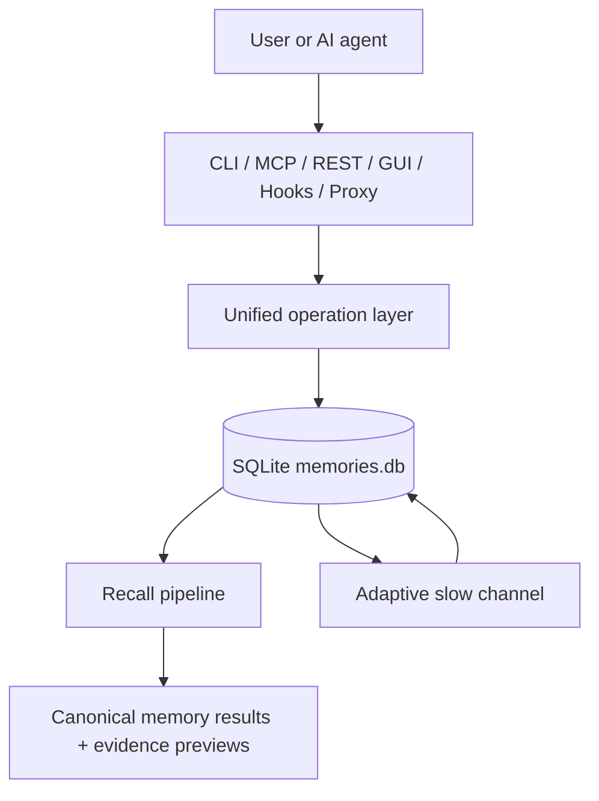
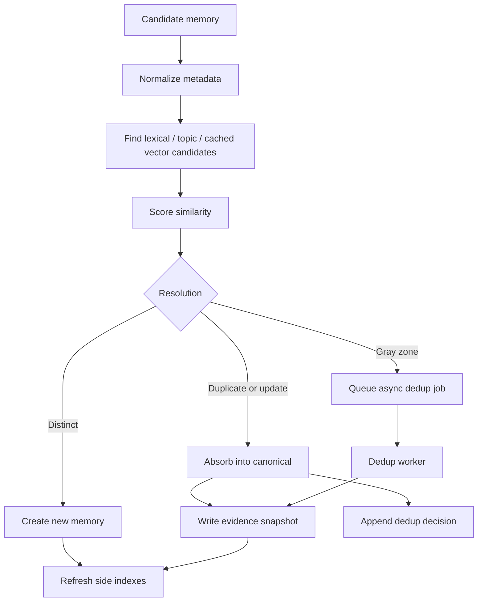
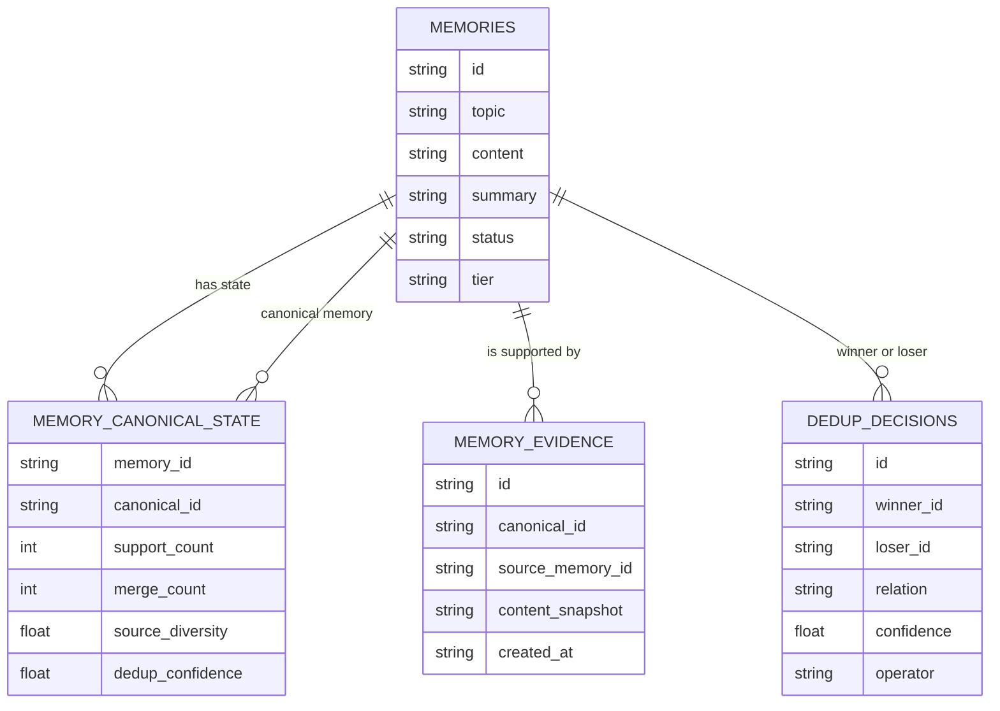
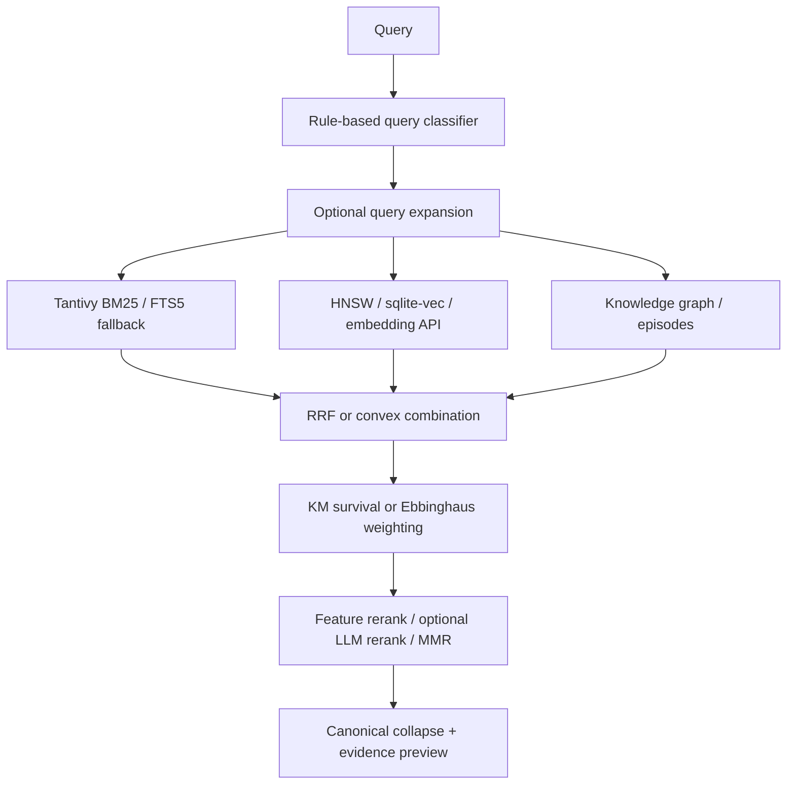
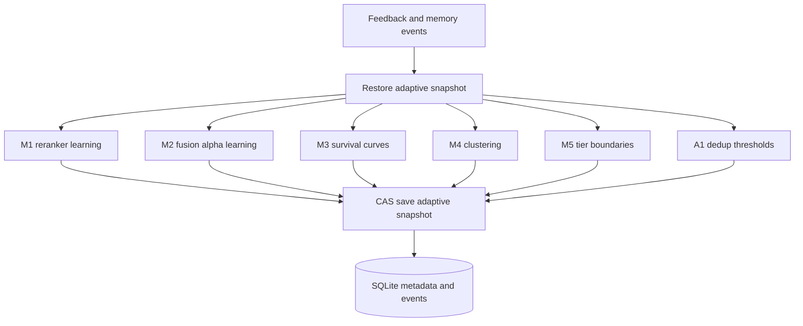
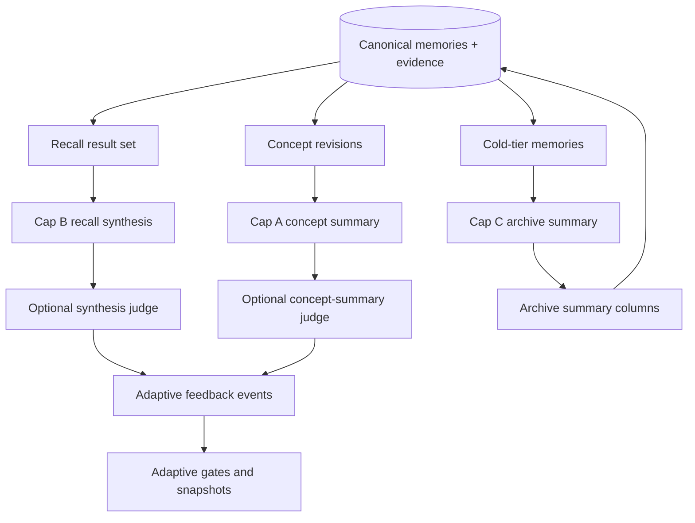

# Mechanism

This chapter explains how Rein moves information from observation to storage,
recall, feedback, and optional projections. The durable center is the local
SQLite store. Search indexes, summaries, synthesis outputs, and adaptive state
are derived views around that store.

## End-to-End Flow

The public surfaces call the same operation layer. Store, recall, maintenance,
knowledge graph, ARS, and judge operations are registered once and then exposed
through CLI, MCP, and REST where applicable. This keeps behavior aligned across
agent tools and operator commands.

## Ingestion Lifecycle

Rein can ingest memory through direct CLI or MCP store calls, GUI or REST writes,
hook extraction, proxy recording, migration commands, consolidation, and update
flows. The exact source can differ, but the storage lifecycle follows the same
shape:

1. A surface submits candidate memory content with topic, importance, keywords,
   source metadata, or extraction context.
2. Lightweight post-processing normalizes and enriches metadata while preserving
   caller-provided topic and importance.
3. Store-time dedup searches for nearby memories using lexical candidates,
   topic-variant expansion, adaptive thresholds, and cached embedding hints
   when available.
4. Strong duplicate or update decisions are resolved immediately inside a
   SQLite write transaction.
5. Gray-zone decisions can be queued for warm-path dedup so the hot path does
   not block on remote LLM calls.
6. Side indexes are updated or scheduled after the durable write.
7. Feedback and maintenance events are emitted for the adaptive slow channel.

Hot-path ingestion avoids remote calls on cache misses. More expensive LLM
classification, consolidation, and vector sweeps belong to warm or cold
maintenance paths.

## Storage, Canonical, And Evidence Model

The `memories` table stores durable memory rows. Rein then layers canonical
state and evidence around those rows:

- `memory_canonical_state` maps raw or superseded rows to the current canonical
  memory and stores support counters such as support count, merge count, source
  diversity, dedup confidence, and contradiction score.
- `memory_evidence` keeps immutable snapshots of observations absorbed during
  duplicate, update, merge, or consolidation decisions.
- `dedup_decisions` records the append-only decision ledger with winner, loser,
  score, relation, confidence, reason, operator, reversibility, and payload.
- Side indexes such as Tantivy, HNSW, sqlite-vec, FTS5, and graph tables
  accelerate retrieval but do not replace the SQLite truth.

Canonical-first reads make the user-facing result stable while keeping evidence
available for inspection. A recall result should be read as "this is the current
canonical memory, with these supporting observations," not as a raw dump of
every matching row.

## Recall Lifecycle

Recall starts with a rule-based classifier that selects a query strategy such as
semantic, temporal, episodic, preference, exact keyword, or exploratory. Rein can
then expand the query, search multiple channels, fuse the candidates, apply
decay and recency weighting, rerank, diversify, and collapse raw hits to
canonicals.

The output path keeps evidence lightweight by default. Recall responses include
canonical memory results plus evidence counts and previews. Full evidence is
expanded through detail views or explicit evidence commands.

## Adaptive Slow Channel

Adaptive work runs outside the request hot path where possible. It consumes
events from store, recall, dedup, cleanup, feedback, synthesis, concept summary,
judge, and archive workflows.

The slow channel can rebuild HDBSCAN cluster state, write Kaplan-Meier survival
curves and a global prior, update hot/warm/cold tier boundaries, optimize
retrieval fusion weights, adjust reranker features, and learn per-cluster dedup
thresholds. When there is not enough signal, Rein uses cold-start defaults or
global priors instead of pretending the data is mature.

## ARS Projections

ARS features are optional projections over stored memories and feedback. They
can make memory easier to consume, but they are not the authoritative store.

- Cap A: concept living summaries. `rein_concept_state` and
  `rein_concept_summary_refresh` expose and refresh concept-level summaries.
  `rein_feedback_concept_summary` and optional judge events feed adaptive
  usefulness gates for this surface.
- Cap B: recall synthesis. `rein_recall` can request `synthesize=true`, which
  asks an LLM to write a concise answer from the returned memories only. The
  output is attached to the recall result and can be judged or fed back, but the
  source memories remain authoritative.
- Cap C: cold archive summaries. `rein_archive_summary_refresh` and cold-tier
  workers can generate compact summaries for cold memories under prompt and
  size limits. Archive summaries are cached projections and can be regenerated
  when source content changes.

ARS calls resolve their own LLM configuration and are guarded by feature flags,
prompt caps, cache checks, and adaptive gates. Default-off deployments should
not gain hidden LLM writes merely because base memory storage or recall is in
use.

## Failure And Consistency Boundaries

Rein treats SQLite writes as the consistency boundary. Side indexes are
rebuildable and can skip updates when locks or transient errors occur. Remote
LLM or embedding failures should fail, skip, or fall back according to the
specific feature without corrupting the store. Maintenance workers use claim,
cache, or compare-and-swap patterns where stale or concurrent work could
otherwise overwrite fresher state.
