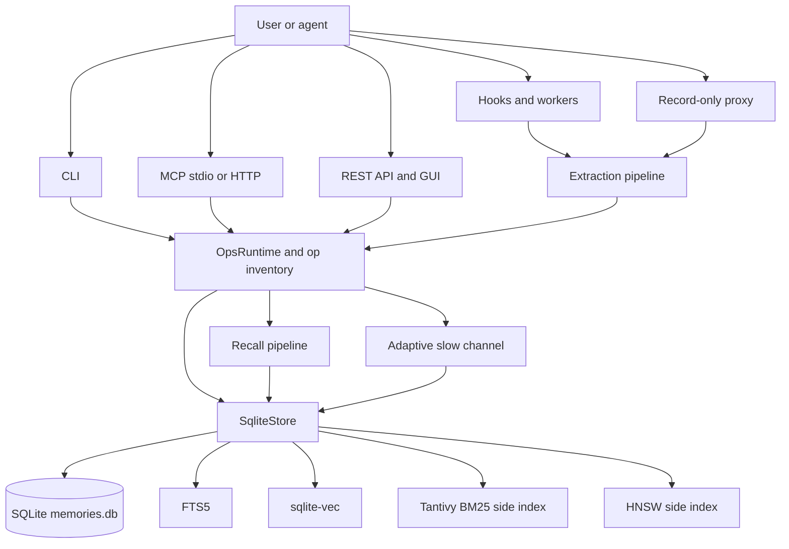

# Architecture

Rein is a Rust workspace with one runtime crate, `crates/rein`, and one
procedural macro crate, `crates/rein-macros`. The runtime crate builds a single
binary that exposes CLI, MCP, REST, GUI, hook, worker, and record-only proxy
surfaces over the same local SQLite store.

## Crate Boundaries

`crates/rein/src/main.rs` is the binary entry point. It defines the remaining
hand-written clap subcommands such as `serve`, `init`, `ingest`, `worker`,
`hook`, `gui`, and `proxy`. It also augments the clap command with inventory
registered commands before parsing, so migrated operations appear in normal
`rein --help` output and dispatch through the same runtime as MCP and REST.

`crates/rein/src/lib.rs` is the public library root. It re-exports the major
modules and carries the public source URL and AGPL SPDX identifier that network
responses surface through headers and metadata.

`crates/rein/src/commands.rs` contains handler bodies for the command variants
that still live in `main.rs`. The file is intentionally a bridge around older
CLI flows; migrated business operations live under `ops/handlers`.

`crates/rein-macros` provides the `#[op]` attribute. The macro validates op
metadata at compile time and emits inventory registrations for selected
surfaces. This keeps the authoritative command, MCP tool, and REST route
metadata next to the handler implementation.

## Unified Operation Model

Operations are implemented as methods on `OpsRuntime` in
`crates/rein/src/ops/handlers/`. Handler modules group related surfaces:
memory, maintenance, diagnostics, adaptive feedback, knowledge graph, session
ingest, archival summaries, concept-summary feedback, and judge enqueue tools.

`crates/rein/src/ops/inventory.rs` defines the runtime records emitted by the
macro:

- `OpsCliEntry` for clap command construction and CLI invocation.
- `OpsMcpEntry` for MCP tool schema and tool-call invocation.
- `OpsRestEntry` for HTTP method, path template, auth policy, and REST
  invocation.
- `OpsMetadata` for shared category, description, visibility, mutability, and
  schema metadata.

The inventory also enforces duplicate detection for CLI names, MCP names, and
REST method/path pairs. REST auth policy is declared as op metadata, so migrated
routes do not bypass route-local guards.

## MCP And REST Adapters

`crates/rein/src/mcp/server.rs` owns stdio and HTTP MCP service setup. The MCP
server creates an `OpsRuntime` per call and dispatches by `OpsMcpEntry`, rather
than maintaining a separate hand-written tool router. Each request opens its
own store connection through config, relying on SQLite serialized mode and WAL
for concurrency.

HTTP/GUI startup may spawn one background warmup for side-index repair and
embedding precomputation. Stdio MCP startup skips that by default because
multi-agent clients can start many short-lived `rein serve` processes; operators
can opt back in with `[server].stdio_background_warmup = true`.

`crates/rein/src/mcp/rest.rs` serves the GUI API and inventory-backed REST
routes. It progressively caps request body size, resolves exact and templated
routes from `OpsRestEntry`, applies the entry auth policy, and emits JSON
responses with source and license headers. GUI assets are served from the same
HTTP process when the `gui` feature is built and enabled.

## Storage Model

`crates/rein/src/store/sqlite.rs` is the main durable store implementation. It
wraps a `rusqlite::Connection`, opens databases with `SQLITE_OPEN_FULL_MUTEX`,
enables WAL and foreign keys, and implements memory CRUD, canonical collapse,
evidence snapshots, recall helpers, knowledge graph access, and side-index
maintenance.

`crates/rein/src/store/schema.rs` creates and migrates the schema. The public
model centers on:

- `memories`: canonical and source memory rows with layer, status, tier,
  cluster, timestamps, and archival summary fields.
- `memory_canonical_state`: canonical identity, support count, merge count,
  confidence, source diversity, and contradiction score.
- `memory_evidence`: provenance snapshots absorbed into a canonical memory.
- `dedup_decisions`: an append-only merge and dedup ledger.
- `memoirs`, `concepts`, and `concept_links`: temporal knowledge graph state.
- `feedback_events`, consumer offsets, and adaptive snapshots used by the slow
  channel.

SQLite FTS5 tables are maintained by triggers for memories and concepts.
sqlite-vec stores embeddings inside the database. Tantivy and HNSW are side
indexes: they improve recall latency and ranking, but durable truth remains in
SQLite. Write paths update or mark these side indexes after durable database
changes; rebuild and dirty markers protect concurrent warmup or repair work.

## Search Modules

The `search` module implements recall:

- `classify.rs` routes queries into episodic, temporal, preference,
  exact-keyword, semantic, or exploratory strategies using deterministic text
  rules.
- `recall.rs` coordinates expansion, FTS, vector, knowledge graph, fusion,
  weighting, reranking, canonical collapse, evidence previews, feedback event
  emission, and optional synthesis output.
- `kg_search.rs` implements concept FTS plus breadth-first "land and expand"
  traversal over valid temporal links.
- `rrf.rs` implements Reciprocal Rank Fusion and convex combination fusion.
- `rerank.rs`, `rerank_llm.rs`, and `mmr.rs` implement learned feature rerank,
  optional LLM rerank, strong-signal bypass, and diversity reranking.
- `scoring.rs` and `survival.rs` implement Ebbinghaus fallback decay and
  Kaplan-Meier survival-curve scoring.
- `expand.rs` and `alpha_optimizer.rs` implement query expansion and
  counterfactual alpha learning inputs.

## Extraction, Proxy, And Hooks

The `extract` module turns sessions, hook payloads, proxy observations, and
manual input into memory candidates. LLM extraction is optional and falls back
to local pattern rules. The hook pipeline includes a file-backed async queue,
session buffer parsing, project working sets, and persistence helpers.

The `proxy` module is record-only. It mirrors supported provider requests and
responses into the extraction queue without modifying upstream requests. Proxy
auth, Host/Origin checks, and recording gates are separate from memory ranking
logic.

## Adaptive Modules

`ops/adaptive.rs` is the adaptive slow-channel orchestrator. A pass restores an
adaptive snapshot, runs readiness-gated learning steps, drains event-sourced
consumers with peek-then-commit offsets, persists a merged snapshot, and only
then advances consumer cursors. Its major jobs are clustering, survival curves,
tiering, alpha learning, reranker learning, M6 threshold learning, vector dedup,
and ARS feedback aggregation.

`store/adaptive.rs` owns the event log, adaptive state serialization, consumer
offsets, concept-summary and synthesis feedback aggregates, calibration state,
and cluster profiles used by the GUI.

## GUI

`crates/rein/gui` is a React, TypeScript, Tailwind, and Vite application. The
Rust crate can embed the built assets behind the `gui` feature. At runtime the
GUI talks to REST endpoints under `/api`, so it observes the same auth policy,
inventory routes, and JSON shapes as external REST clients.

## Contributor Invariants

Preserve these architecture rules when changing product code:

- Durable state belongs in SQLite; side indexes are rebuildable accelerators.
- New shared operations should use `#[op]` unless they are truly surface-local.
- Mutating REST ops must declare the correct inventory auth policy.
- MCP, CLI, and REST behavior should share handler code instead of drifting.
- Store writes that affect canonical, evidence, or side-index state must keep
  database changes atomic and side-index updates consistent with committed DB
  state.
- Recall returns canonical-first results and expands evidence on demand.
- Adaptive consumers should not advance offsets until their derived state is
  durably saved.
- LLM-backed features must retain local fallback or explicit opt-in behavior.
