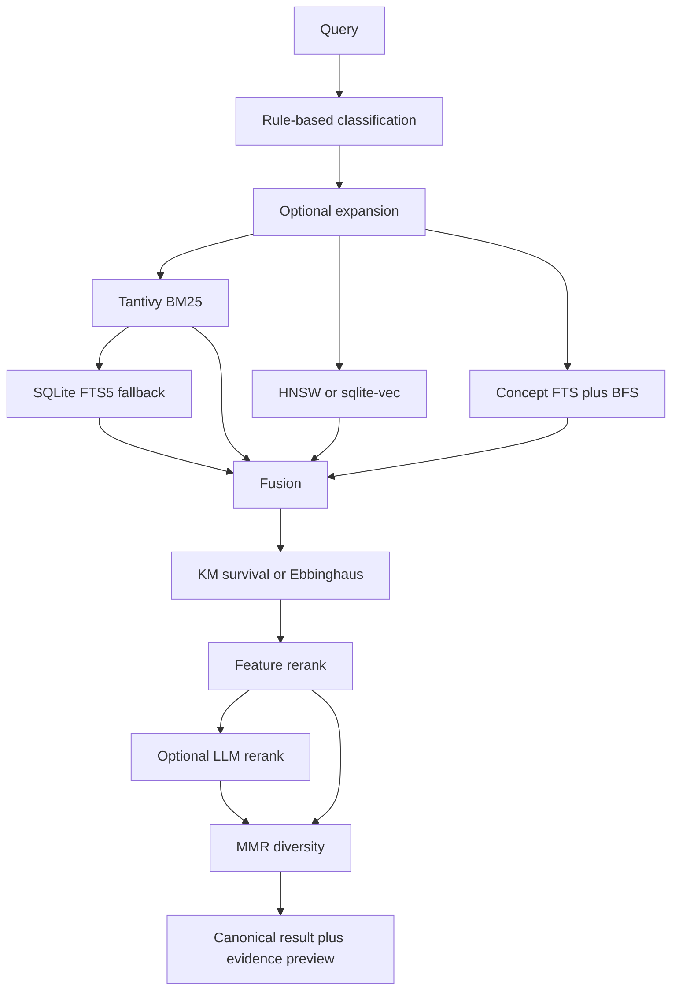
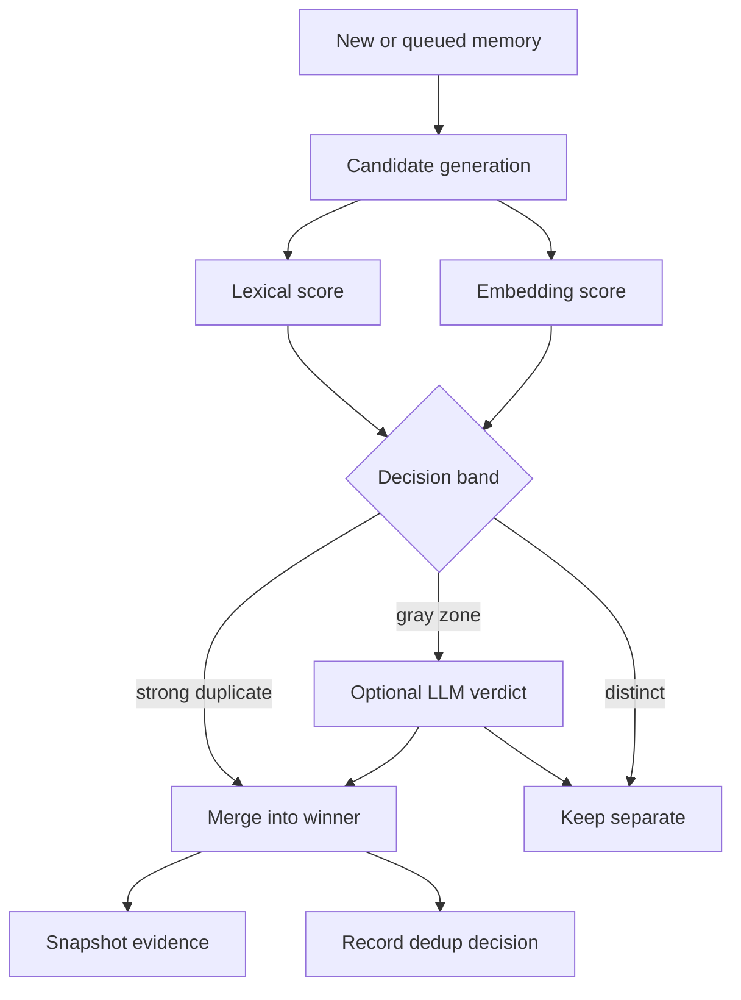

# Algorithms

This chapter maps Rein's algorithmic behavior to code modules and research
references. It describes what the current code implements, not a roadmap.
Equations use GitHub Markdown math.

## Notation

Let `q` be a recall query, `d` a candidate memory, `C` a candidate set, `T(x)`
the normalized token set for text `x`, and `E(x)` an embedding vector. Scores
are normalized to `[0, 1]` unless a section says otherwise.

`clip(x, a, b)` means clamping `x` into `[a, b]`.

## Recall Pipeline



`search/recall.rs` coordinates the hot path:

1. Classify the query into a deterministic strategy.
2. Optionally expand the query.
3. Gather text, vector, graph, and episode candidates.
4. Fuse ranked lists.
5. Apply memory strength and recency weighting.
6. Run feature reranking, optional LLM reranking, and optional MMR diversity.
7. Collapse superseded rows to canonicals and attach evidence previews.
8. Emit recall feedback events for the adaptive slow channel.

The recall output should be read as a canonical result set. Evidence rows are
supporting observations, not separate competing memories.

## Query Classification

`search/classify.rs` uses deterministic string rules, Unicode NFKC
normalization, and route priority to classify queries as episodic, temporal,
preference, exact keyword, semantic, or exploratory. The classifier sets knobs
such as candidate-limit multiplier, temporal bounds, and initial
convex-combination alpha.

Representative route intent:

| Query type | Retrieval bias | Operational purpose |
| --- | --- | --- |
| `exact_keyword` | High sparse alpha | Code symbols, exact IDs, error fragments. |
| `temporal` | Sparse plus time bounds | Questions about when something happened. |
| `semantic` | Dense/vector bias | Paraphrased concepts and descriptions. |
| `preference` | Memory-type bias | User preference and standing instructions. |
| `episodic` | Graph and episode signals | Session/event reconstruction. |
| `exploratory` | Broader candidate limit | Open-ended "what do I know" queries. |

This classifier is intentionally not an LLM call. It gives the adaptive layer a
stable `query_type` key for alpha learning, synthesis feedback, and concept
summary buckets.

## Ingestion Admission

Hook and async-worker ingestion use a multi-factor admission score in
`extract/hooks/persist.rs`. The score is inspired by memory-admission research
[18], but the implemented policy is local and auditable.

For an extracted item `m`, Rein computes:

$$
A(m) = \mathrm{clip}(0.45Q + 0.25N + 0.15P + 0.15R - C, 0, 1)
$$

where:

- `Q` is the extractor's `quality_confidence`.
- `N` is novelty against current canonical topic and cluster memories.
- `P` is a topic-type prior.
- `R` is a fixed recency prior, currently `0.7`.
- `C` is a cold-start penalty, currently `0.02` when no cluster context exists.

If `Q < 0.05`, admission returns `0.0` immediately. This prevents very low
confidence extraction from passing due to novelty alone.

Novelty is computed as one minus the maximum lexical similarity against a
bounded comparison set:

$$
N_{\text{topic}} = 1 - \max_{d \in D_{\text{topic}}} \mathrm{sim}(m, d)
$$

When cluster context exists, topic novelty and cluster novelty are blended:

$$
\rho = \mathrm{clip}\left(\frac{|D_{\text{cluster}}|}{8}, 0, 1\right)
$$

$$
N = (1 - \rho)N_{\text{topic}} + \rho N_{\text{cluster}}
$$

The default type prior is interpretable:

| Topic cue | Base prior |
| --- | ---: |
| architecture, decision, design | 0.90 |
| workflow, deployment, config | 0.70 |
| debug, error, fix | 0.50 |
| other | 0.60 |

Cluster strength can adjust the prior by `+0.08` or `-0.08` before clamping.

The admission threshold starts from a global baseline:

$$
\theta_g =
\begin{cases}
\min(1.1b, 0.60), & \bar{s}_{recent} < 0.4 \\
\max(0.9b, 0.15), & \bar{s}_{recent} > 0.7 \\
b, & \text{otherwise}
\end{cases}
$$

with `b = 0.20`. For clustered memories, Rein computes:

$$
\theta_c = \mathrm{clip}\left(
\theta_g \cdot \frac{\bar{s}_{recent}}{\max(\bar{s}_{cluster}, 0.1)},
0.15,
0.60
\right)
$$

and blends the global and cluster thresholds:

$$
\theta = \mathrm{clip}((1 - \rho)\theta_g + \rho\theta_c, 0.15, 0.60)
$$

The item is stored only when `A(m) >= theta`, after secret filtering and other
policy checks.

## Text Retrieval

Rein uses two lexical search layers:

- Tantivy BM25 in `store/tantivy_fts.rs`, used first when the side index is
  available.
- SQLite FTS5 in `store/schema.rs` and store FTS helpers, used as a durable
  fallback and kept synchronized by triggers [13].

BM25 follows the probabilistic relevance family described by Robertson and
Zaragoza [5]. In standard notation:

$$
\mathrm{BM25}(d, q) =
\sum_{t \in q}
\mathrm{IDF}(t)
\frac{f(t,d)(k_1 + 1)}
{f(t,d) + k_1\left(1 - b + b\frac{|d|}{\mathrm{avgdl}}\right)}
$$

where `f(t,d)` is term frequency in document `d`, `|d|` is document length, and
`avgdl` is average document length.

For CJK and mixed technical text, `extract/dedup.rs` exposes shared
tokenization helpers. The token set is approximately:

$$
T(x) = T_{\text{whitespace}}(x) \cup T_{\text{jieba}}(x) \cup T_{\text{cjk-bigram}}(x)
$$

This avoids treating Chinese, Japanese, Korean, and mixed code prose as
whitespace-only text.

## Vector Retrieval

Embedding dimensions are configurable and default to the Gemini embedding
configuration used by the project. Google documentation and the Gemini
Embedding technical report describe 3072-dimensional output support and dated
benchmark results; Rein treats those claims as provider documentation, not as a
local benchmark result [12].

`store/vec.rs` stores vectors in sqlite-vec and provides exact vector search
fallback. `store/hnsw.rs` maintains a usearch-backed HNSW side index for faster
approximate nearest-neighbor lookup. HNSW follows the navigable small-world
graph family described by Malkov and Yashunin [7].

Cosine similarity is the relevant dense signal:

$$
\mathrm{cos}(a,b) =
\frac{E(a) \cdot E(b)}
{\|E(a)\|_2 \|E(b)\|_2}
$$

and cosine distance is:

$$
d_{\cos}(a,b) = 1 - \mathrm{cos}(a,b)
$$

The HNSW index is rebuildable. SQLite and sqlite-vec remain the durable
embedding store.

## Knowledge Graph Retrieval

`search/kg_search.rs` retrieves graph-backed evidence in two stages. First it
lands on concepts through concept FTS. Then it expands from seed concept IDs
with breadth-first traversal over concept links.

A temporal edge is usable at time `tau` only when:

$$
\mathrm{validFrom}(e) \le \tau
$$

and either:

$$
\mathrm{validUntil}(e) = \mathrm{NULL}
$$

or:

$$
\tau < \mathrm{validUntil}(e)
$$

The graph channel contributes candidate memory IDs and contextual scores. It is
not a separate durable truth source; memory, concept, and link rows remain in
SQLite.

## Fusion

`search/rrf.rs` implements Reciprocal Rank Fusion and convex combination.

For ranked lists `L_i`, weights `w_i`, smoothing constant `k`, and zero-based
rank `r_i(d)`, RRF is:

$$
S_{\text{RRF}}(d) =
\sum_i
\frac{w_i}{k + r_i(d) + 1}
$$

Documents absent from a list contribute `0`. The default `k` is configured in
search settings and commonly uses `60.0`.

Convex combination first min-max normalizes sparse and dense scores:

$$
\hat{s}_i(d) =
\frac{s_i(d) - \min(s_i)}
{\max(s_i) - \min(s_i)}
$$

Then it blends sparse and dense channels:

$$
S_{\text{CC}}(d) =
\alpha \hat{s}_{\text{sparse}}(d) +
(1 - \alpha)\hat{s}_{\text{dense}}(d)
$$

High `alpha` favors lexical evidence; low `alpha` gives more weight to dense
semantic evidence. Singleton result lists are preserved as a score of `1.0`.
Flat ties with multiple items are dropped from that channel because they carry
no ranking signal.

RRF follows Cormack, Clarke, and Buettcher [3]. Convex combination follows the
hybrid retrieval fusion family analyzed by Bruch, Gai, and Ingber [4].

## Reranking And Diversity

`search/rerank.rs` applies a linear feature reranker. Features include BM25,
vector score, recency, memory strength, importance, access count, source
diversity, support count, tier, and cluster survival.

The general shape is:

$$
S_{\text{rank}}(d) =
\beta_0 + \sum_j \beta_j x_j(d)
$$

where `x_j(d)` are normalized features and `beta_j` are default or learned
weights. `search/rerank_llm.rs` can optionally rescore top candidates with a
configured LLM. Strong lexical signals can bypass expansion or LLM reranking to
avoid unnecessary latency and cost.

`search/mmr.rs` applies Maximal Marginal Relevance as a final diversity pass
when enabled [6]. Given selected set `S`, the next result is:

```math
d^* =
\arg\max_{d \in C \setminus S}
\left[
\lambda \mathrm{rel}(d)
-
(1 - \lambda)\max_{s \in S}\mathrm{sim}(d,s)
\right]
```

Rein approximates `sim(d,s)` without extra embedding calls:

- Same topic: `1.0`.
- Shared topic prefix: `(shared_segments / max_segments) * 0.7`.
- Keyword overlap: Jaccard over keyword sets.

The final pairwise similarity is the maximum of topic-prefix and keyword
signals.

## Decay And Survival

`search/scoring.rs` computes memory strength. Critical memories do not decay:

$$
\mathrm{strength}(d,t) = 1
$$

for `importance = critical`.

Other memories use an Ebbinghaus-style fallback curve [2]:

$$
E(t) = \exp(-\lambda_{\text{eff}}t^\beta)
$$

where:

$$
\lambda_{\text{eff}} =
\frac{\lambda}{1 + 0.2a}
$$

`t` is days since last access, `a` is access count, and `beta` comes from the
memory layer. Accesses slow decay by reducing the effective hazard.

The final retrieval score after strength weighting is:

$$
S_{\text{weighted}}(d) =
S_{\text{retrieval}}(d)
\cdot \mathrm{strength}(d,t)
\cdot (1 + 0.2a)
\cdot B_{\text{recent}}(d)
$$

where recency boost is:

$$
B_{\text{recent}}(h) =
\begin{cases}
1.5, & h \le 24 \\
1 + 0.5\left(1 - \frac{h - 24}{144}\right), & 24 < h \le 168 \\
1.0, & h > 168
\end{cases}
$$

`search/survival.rs` implements Kaplan-Meier survival estimation over access
intervals [1]. At event time `t_i`, with `d_i` observed re-access events and
`n_i` memories at risk:

$$
\hat{S}(t) =
\prod_{t_i \le t}
\left(1 - \frac{d_i}{n_i}\right)
$$

Censored observations reduce the risk set without creating a survival drop.
Past the last observed step, Rein uses a log-linear extension when possible:

$$
h =
-\frac{\ln(S_{\text{last}} / S_{\text{prev}})}
{t_{\text{last}} - t_{\text{prev}}}
$$

$$
S(t) =
S_{\text{last}}
\exp(-h(t - t_{\text{last}}))
$$

Cold-start blending keeps sparse data from overpowering the fallback:

$$
\mathrm{strength}(t) =
\begin{cases}
E(t), & n < 20 \\
(1-\gamma)E(t) + \gamma\hat{S}(t), & 20 \le n < 50 \\
\hat{S}(t), & n \ge 50
\end{cases}
$$

with:

$$
\gamma = \frac{n - 20}{50 - 20}
$$

If a curve has no uncensored event evidence, Rein uses the Ebbinghaus fallback.
The STM-to-LTM promotion threshold is derived from median survival:

$$
\mathrm{promotionAccesses} =
\mathrm{clip}\left(\left\lceil\frac{m}{7}\right\rceil + 1, 2, 8\right)
$$

where `m` is median survival in days, defaulting to `28` when unavailable.

## Clustering

`store/hdbscan.rs` implements HDBSCAN in Rust: core distances, mutual
reachability, minimum spanning tree construction, condensed cluster tree, and
excess-of-mass stability selection. This follows the hierarchical
density-estimate clustering approach of Campello, Moulavi, and Sander [8].

For point `p`, the core distance is the distance to its `k`-th nearest
neighbor:

$$
\mathrm{core}_k(p) = d(p, \mathrm{kNN}_k(p))
$$

Mutual reachability distance is:

$$
d_{\text{mreach}}(a,b) =
\max(\mathrm{core}_k(a), \mathrm{core}_k(b), d_{\cos}(a,b))
$$

Rein builds an MST over this mutual-reachability graph, converts it into a
single-linkage dendrogram, then condenses that tree using `min_cluster_size`.
The density level is:

$$
\lambda = \frac{1}{d_{\text{mreach}}}
$$

Cluster stability is computed as accumulated lifetime in density space:

$$
\mathrm{stab}(C) =
\sum_{p \in C}
(\lambda_p - \lambda_{\text{birth}}(C))
$$

where `lambda_p` is the level at which point `p` falls out or the cluster dies.
EOM selection compares a cluster's own stability with the sum of its selected
children and keeps the more stable explanation.

`ops/adaptive.rs` runs clustering as M4 when enough embeddings exist, stores
cluster assignments and centroids, clears cluster-scoped adaptive state after a
recluster, and can reassign non-sampled memories to the nearest centroid.
Sampling for large populations uses the reservoir sampling family described by
Vitter [9].

## Deduplication



`extract/dedup.rs` computes lexical similarity with Jaccard and containment
over normalized token sets:

$$
J(a,b) =
\frac{|T(a) \cap T(b)|}{|T(a) \cup T(b)|}
$$

$$
K(a,b) =
\frac{|T(a) \cap T(b)|}{\min(|T(a)|, |T(b)|)}
$$

The lexical duplicate score is:

$$
L(a,b) = \max(J(a,b), K(a,b))
$$

Undefined comparisons with empty token sets do not create merges. Candidate
scoring adds small context bonuses:

$$
S_{\text{dedup}} =
\mathrm{clip}(L + 0.05I_{\text{topic-variant}} + 0.05I_{\text{cluster}}, 0, 1)
$$

where `I` is `1` when the condition is true and `0` otherwise.

Strong matches above the active threshold merge or supersede depending on
temporal and containment checks. Gray-zone matches can use three progressively
more expensive signals:

1. Rule-based triple overlap.
2. Cached embedding cosine.
3. Optional LLM verdict when intelligent merge is enabled and budget is
   available.

Embedding dedup is inspired by SemDeDup-style semantic duplicate detection at
scale [11], but Rein's implementation is specific to local memory: it uses
cluster-aware thresholds, sqlite-vec or HNSW candidates, and a durable evidence
ledger. In large unclustered buckets, ANN candidate generation avoids a full
pairwise scan. Merges preserve novel facts instead of hard-deleting the loser.

## Adaptive Learning

`ops/adaptive.rs` orchestrates Rein's adaptive slow channel. It is event-sourced
through `feedback_events` and guarded by consumer offsets. Consumers peek
events, update in-memory adaptive state, save the state, and only then commit
offsets. This follows the same high-level feedback principle as implicit
feedback systems [10], but Rein's features and state are local to memory
retrieval.

The main loops are:

- M1: emit and consume feedback events from recall, maintenance, ARS surfaces,
  and judge pipelines.
- M2: learn fusion alpha by replaying recall candidates and observed accesses
  in `search/alpha_optimizer.rs`.
- M3: build per-cluster Kaplan-Meier survival curves for decay and promotion.
- M4: cluster embedding space with HDBSCAN and maintain cluster assignments.
- M5: compute tier boundaries and migrate cold memories through archival
  storage and optional summary generation.
- M6: consume threshold exploration and co-recall signals to adjust global
  dedup threshold state.
- A1: compute per-cluster dedup thresholds, using cluster similarity
  distributions and fallback global thresholds.

### M2 Alpha Learning

Alpha controls sparse-vs-dense fusion in convex combination:

$$
S_{\text{CC}}(d;\alpha) =
\alpha \hat{s}_{\text{sparse}}(d) +
(1-\alpha)\hat{s}_{\text{dense}}(d)
$$

The optimizer replays historical recall candidates against observed access
events, then selects alpha values that would have ranked accessed memories
higher. Learned values are bucketed by global, query type, and cluster context
when enough samples exist. Updates are damped by `alpha_max_step` to avoid
large jumps after a small feedback batch.

The ARS acceleration path also maintains shadow six-dimensional fusion weights
for BM25, vector, graph, episode, support, and diversity signals. These weights
are learned by deterministic replay over a bounded simplex candidate set:
one-hot dimensions, pairwise blends, accessed-candidate centroids, and
accessed-vs-other feature gaps. They remain shadow-only unless explicit canary
policy enables runtime adoption.

### ARS Dynamic Parameter Rollout

ARS acceleration keeps static configuration as the anchor. Learned values only
affect runtime behavior when `[ars.acceleration]` is explicitly enabled,
`shadow_only = false`, the `ars_parameter_policy` row is healthy, and
`runtime_adoption_weight > 0`.

For scalar parameters, Rein computes a dynamic trust value:

$$
\tau =
\frac{e}{e + p}
\cdot c
\cdot s
\cdot m
\cdot w
$$

where `e` is effective evidence count, `p` is prior strength, `c` is calibration
quality, `s` is recent stability, `m` is a per-parameter trust cap, and `w` is
`runtime_adoption_weight`. Drift alerts or disabled canary mode set `tau` to
zero.

The effective runtime value is then a bounded blend:

$$
x_{\mathrm{effective}} =
\mathrm{clip}\left((1-\tau)x_{\mathrm{static}} + \tau x_{\mathrm{learned}},
x_{\min}, x_{\max}\right)
$$

For parameters with stored previous effective values, each adaptive pass also
applies a per-parameter max step before committing the new snapshot. The same
principle is used for six-dimensional recall fusion weights, except the blend
is normalized back onto the simplex after combining static and learned weights.

This rollout layer is deliberately gradual. `runtime_adoption_weight` moves by
at most `0.05` per durable adaptive snapshot and resets to zero outside canary
mode. It gates recall fusion, synthesis and concept-summary gates, LLM judge
sample rates, LLM judge decay, and SignalHint-derived useful-rate priors.

### M5 Tiering

Tiering computes access-rate distributions and assigns hot, warm, and cold
tiers. In simplified form, with access rate `r_d`:

$$
\text{tier}(d) =
\begin{cases}
\text{hot}, & r_d \ge Q_{75} \\
\text{cold}, & r_d \le Q_{25} \\
\text{warm}, & \text{otherwise}
\end{cases}
$$

Cold-tier rows can become inputs for optional archival summaries when the
matching ARS feature is enabled.

### M6 And A1 Thresholds

Store-time dedup usually uses the active threshold. M6 explores it on a small
fraction of calls by applying an offset:

$$
\theta' = \mathrm{clip}(\theta + \delta, 0.30, 0.95)
$$

with `delta` sampled from approximately `[-0.10, 0.10]` by a deterministic
pseudo-random counter. Outcomes are logged as feedback events. Once enough
raised and lowered samples exist, Rein compares duplicate rates and nudges the
global threshold by `0.02`, clamped to `[0.40, 0.90]`.

A1 computes per-cluster thresholds from sampled pairwise lexical similarities.
For cluster `c`:

$$
\theta_c =
\mathrm{clip}
\left(
\mathrm{P90}\{L(d_i,d_j): d_i,d_j \in c, i < j\},
0.40,
0.90
\right)
$$

The global threshold can also be updated from the aggregate pairwise
distribution when enough samples exist.

### Runtime Judge Feedback

The runtime judge added in v0.27 is an optional feedback source for synthesis
and concept-summary quality. It enqueues and consumes LLM judge events when the
feature is enabled, compares runtime and offline judge streams for calibration,
and feeds useful-rate style aggregates. It does not replace the durable memory
model or make dedup decisions by itself. In v0.28.4, shadow judge jobs may carry
bounded `signal_hint` evidence derived from already-recorded interaction stats;
the hint does not create extra LLM calls or bypass the normal policy gates. In
v0.28.5, those policy gates include `runtime_adoption_weight`, so LLM feedback
accelerates tuning gradually instead of replacing static ARS parameters at once.

## Background Research

Rein also tracks recent memory-system research as design background. TA-Mem,
MemR3, and A-MAC are listed in the bibliography as inspiration only [16-18].
They should not be read as implemented algorithms unless a future code change
explicitly wires one of their methods into the runtime.
