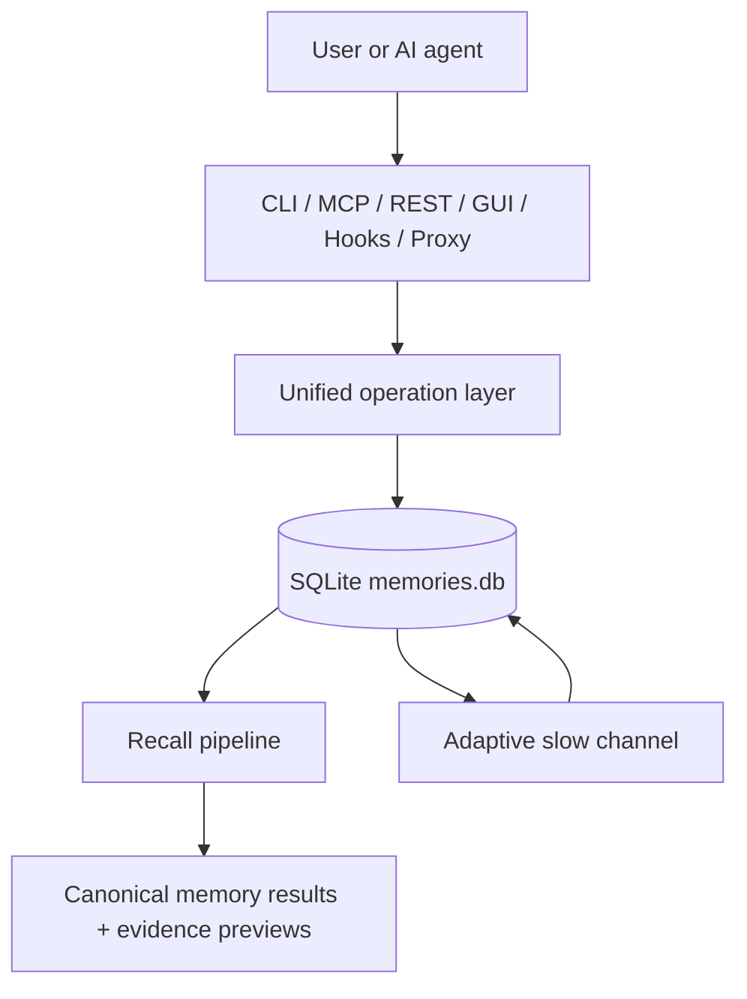
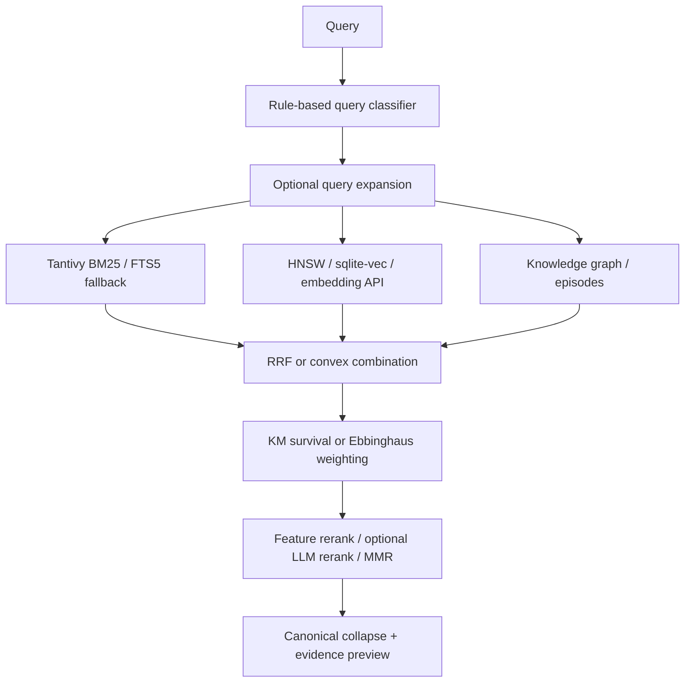

# Open Source Manual Implementation Plan

> **For agentic workers:** REQUIRED SUB-SKILL: Use superpowers:subagent-driven-development (recommended) or superpowers:executing-plans to implement this plan task-by-task. Steps use checkbox (`- [ ]`) syntax for tracking.

**Goal:** Build a GitHub-ready English manual and reference set for Rein's installation, mechanism, architecture, algorithms, operations, security model, and bibliography.

**Architecture:** Keep the repository root README as a short entry point and move durable explanations into focused Markdown chapters under `docs/manual/`. Put fast-changing tables and citations under `docs/reference/`. Use GitHub-compatible Mermaid diagrams and Nature-style numbered references.

**Tech Stack:** Markdown, GitHub Mermaid, Rust source inspection through `rg`, no documentation site generator.

---

## File Structure

- Create `docs/manual/README.md`: public manual landing page and reading paths.
- Create `docs/manual/01-overview.md`: product framing and design principles.
- Create `docs/manual/02-installation.md`: source, Docker, GUI, MCP, and proxy deployment.
- Create `docs/manual/03-mechanism.md`: end-to-end mechanism with Mermaid diagrams.
- Create `docs/manual/04-architecture.md`: code architecture and module map.
- Create `docs/manual/05-algorithms.md`: algorithm explanations tied to code and references.
- Create `docs/manual/06-operations.md`: operator workflows.
- Create `docs/manual/07-security.md`: privacy, auth, proxy, and AGPL network-use model.
- Create `docs/reference/cli.md`: CLI command reference.
- Create `docs/reference/mcp-tools.md`: 38 production MCP tools.
- Create `docs/reference/rest-api.md`: compact REST route reference.
- Create `docs/reference/config.md`: config and environment variable reference.
- Create `docs/reference/bibliography.md`: Nature-style references.
- Modify `README.md`: add a clear manual link, correct high-impact drift, and avoid duplicating long reference tables.

## Task 1: Manual Core

**Files:**
- Create: `docs/manual/README.md`
- Create: `docs/manual/01-overview.md`
- Create: `docs/manual/03-mechanism.md`

- [x] **Step 1: Create `docs/manual/README.md`**

Use this structure:

```markdown
# Rein Manual

Updated for Rein v0.27.5.

Rein is a local-first, self-adaptive memory system for AI agents. It provides a
single Rust binary with CLI, MCP, REST, GUI, hook, and record-only proxy
surfaces over one local SQLite memory store.

## Start Here

- New users: [Installation](02-installation.md)
- Operators: [Operations](06-operations.md)
- Contributors: [Architecture](04-architecture.md)
- Algorithm readers: [Algorithms](05-algorithms.md)
- Security reviewers: [Security](07-security.md)

## Chapters

1. [Overview](01-overview.md)
2. [Installation](02-installation.md)
3. [Mechanism](03-mechanism.md)
4. [Architecture](04-architecture.md)
5. [Algorithms](05-algorithms.md)
6. [Operations](06-operations.md)
7. [Security](07-security.md)

## References

- [CLI reference](../reference/cli.md)
- [MCP tools](../reference/mcp-tools.md)
- [REST API](../reference/rest-api.md)
- [Configuration](../reference/config.md)
- [Bibliography](../reference/bibliography.md)
```

- [x] **Step 2: Create `docs/manual/01-overview.md`**

Cover: what Rein is, non-goals, public surfaces, core principles, current limits.
Use only public repository paths and GitHub Markdown links.

- [x] **Step 3: Create `docs/manual/03-mechanism.md`**

Include these Mermaid diagrams:





- [x] **Step 4: Self-review**

Run:

```bash
rg -n "TODO|TBD|/Users/|\\[\\[" docs/manual/README.md docs/manual/01-overview.md docs/manual/03-mechanism.md
```

Expected: no matches.

## Task 2: Installation, Operations, And Security

**Files:**
- Create: `docs/manual/02-installation.md`
- Create: `docs/manual/06-operations.md`
- Create: `docs/manual/07-security.md`

- [x] **Step 1: Create `docs/manual/02-installation.md`**

Include:
- prerequisites: Rust/Cargo, Node/npm for GUI, optional Gemini key.
- source install:
  `cargo install --path crates/rein --locked`
  and GUI path with `npm ci && npm run build` plus `--features gui`.
- `./scripts/install.sh` and `REIN_INSTALL_GUI=0`.
- Docker:
  `docker build -t rein .`, `docker compose up -d`, and `docker run`.
- token requirements:
  `REIN_HTTP_TOKEN` for HTTP/SSE/GUI/Docker unless explicit loopback unauth is configured.
  `REIN_PROXY_TOKEN` or fallback `REIN_HTTP_TOKEN` for proxy clients.
- validation commands: `rein init --dry-run`, `rein doctor`, `rein dashboard`,
  `rein store`, `rein recall`.
- Codex MCP table name: `[mcp_servers.<name>]`, citing the bibliography entry for OpenAI Codex MCP docs.

- [x] **Step 2: Create `docs/manual/06-operations.md`**

Include workflows for:
- storing and recalling memories.
- updating and forgetting.
- cleanup, dedup, consolidation, gc, organize.
- workers and queues.
- GUI and proxy service management.
- diagnostics with `rein doctor` and `rein dashboard`.

- [x] **Step 3: Create `docs/manual/07-security.md`**

Include:
- local-first storage boundary.
- bearer token/session behavior.
- default-deny unauthenticated loopback.
- Host/Origin guard.
- record-only proxy guarantee.
- LLM opt-in flags and prompt caps.
- AGPL network-use notice.

- [x] **Step 4: Self-review**

Run:

```bash
rg -n "TODO|TBD|cleanup --async|cargo install --path \\.$|\\[mcp\\.rein\\]|/Users/|\\[\\[" docs/manual/02-installation.md docs/manual/06-operations.md docs/manual/07-security.md
```

Expected: no matches.

## Task 3: Architecture, Algorithms, And Bibliography

**Files:**
- Create: `docs/manual/04-architecture.md`
- Create: `docs/manual/05-algorithms.md`
- Create: `docs/reference/bibliography.md`

- [x] **Step 1: Create `docs/manual/04-architecture.md`**

Cover:
- `crates/rein/src/main.rs`, `lib.rs`, and `commands.rs`.
- `crates/rein-macros` and `#[op]`.
- `ops/handlers`, `ops/inventory`, `mcp/server.rs`, `mcp/rest.rs`.
- `store/sqlite.rs`, `store/schema.rs`, side indexes.
- `search`, `extract`, `proxy`, `gui`, and adaptive modules.

Include a Mermaid system map.

- [x] **Step 2: Create `docs/manual/05-algorithms.md`**

Cover:
- query classification.
- BM25 / FTS / Tantivy / CJK tokenization.
- vector and HNSW.
- KG retrieval.
- RRF and convex combination.
- MMR.
- Kaplan-Meier and Ebbinghaus.
- HDBSCAN.
- SemDeDup-inspired embedding dedup.
- adaptive learning and runtime judge.

Avoid unsupported wording:
- Do not say "zero subjective parameters".
- Do not say M6 implements causal inference.
- Do not cite TA-Mem, MemR3, or A-MAC as implemented algorithms; label them background if used.

- [x] **Step 3: Create `docs/reference/bibliography.md`**

Include Nature-style entries for:
- Kaplan & Meier 1958.
- Ebbinghaus 1885/1913.
- Cormack, Clarke & Buettcher 2009.
- Bruch, Gai & Ingber 2023/2024.
- Robertson & Zaragoza 2009.
- Carbonell & Goldstein 1998.
- Malkov & Yashunin 2020.
- Campello, Moulavi & Sander 2013.
- Vitter 1985.
- Hu, Koren & Volinsky 2008.
- Abbas et al. SemDeDup 2023.
- Google Gemini Embedding docs/blog/tech report.
- SQLite FTS5 docs.
- OpenAI Codex MCP docs.
- TA-Mem, MemR3, and A-MAC as background references if mentioned.

- [x] **Step 4: Self-review**

Run:

```bash
rg -n "TODO|TBD|zero subjective|causal inference|MTEB #1|/Users/|\\[\\[" docs/manual/04-architecture.md docs/manual/05-algorithms.md docs/reference/bibliography.md
```

Expected: no matches.

## Task 4: Public References

**Files:**
- Create: `docs/reference/cli.md`
- Create: `docs/reference/mcp-tools.md`
- Create: `docs/reference/rest-api.md`
- Create: `docs/reference/config.md`

- [x] **Step 1: Create `docs/reference/cli.md`**

Include a compact table of current commands from `main.rs` and inventory-backed
handlers. Mention that `rein --help` is authoritative for exact flag spelling.

- [x] **Step 2: Create `docs/reference/mcp-tools.md`**

List exactly 38 production MCP tools. Include groups:
- core memory.
- maintenance.
- knowledge graph and temporal.
- adaptive, ARS, session, and judge.

- [x] **Step 3: Create `docs/reference/rest-api.md`**

List current public REST route families and auth notes. Exclude test-only
routes. Keep response schemas compact.

- [x] **Step 4: Create `docs/reference/config.md`**

List config sections and environment variables:
`REIN_CONFIG`, `REIN_DB`, `GEMINI_API_KEY`, `SUPERMEMORY_CC_API_KEY`,
`REIN_HTTP_TOKEN`, `REIN_PROXY_TOKEN`, `REIN_SSE_BIND`, `REIN_SSE_PORT`,
`REIN_PROXY_BIND`, `REIN_PROXY_PORT`, `REIN_LOG`,
`REIN_REST_MAX_BODY_BYTES`, `REIN_LLM_CONCURRENCY`,
`REIN_ASYNC_MEMORY_PROVIDER`, `REIN_ASYNC_P1`.

- [x] **Step 5: Self-review**

Run:

```bash
rg -n "TODO|TBD|32 tools|/Users/|\\[\\[" docs/reference/cli.md docs/reference/mcp-tools.md docs/reference/rest-api.md docs/reference/config.md
```

Expected: no matches.

## Task 5: README Integration And Final Verification

**Files:**
- Modify: `README.md`

- [x] **Step 1: Add manual entry link near the top**

Add a short link to `docs/manual/README.md` near the project summary.

- [x] **Step 2: Fix high-impact drift**

Fix:
- "32 tools" -> "38 tools".
- architecture diagram tool count.
- GUI page count if mentioned.
- stale `cleanup --async` claim.
- wording that makes FTS5 unicode61 sound like the CJK segmentation solution.
- "zero subjective parameters" -> "reduces fixed parameters through adaptive feedback".
- "causal inference" for M6 -> "randomized threshold exploration".

- [x] **Step 3: Verify references**

Run:

```bash
rg -n "32 tools|cleanup --async|zero subjective|causal inference|\\[mcp\\.rein\\]|cargo install --path \\.$" README.md docs/manual docs/reference
```

Expected: no matches.

- [x] **Step 4: Verify private references and Markdown hygiene**

Run:

```bash
rg -n "/Users/|\\[\\[|TODO|TBD" README.md docs/manual docs/reference
git diff --check
```

Expected: no matches and no whitespace errors.

- [x] **Step 5: Commit**

Run:

```bash
git add README.md docs/manual docs/reference docs/superpowers/plans/2026-04-30-open-source-manual.md
git commit -s -m "docs: add open source manual"
```

Expected: commit succeeds with DCO sign-off.
